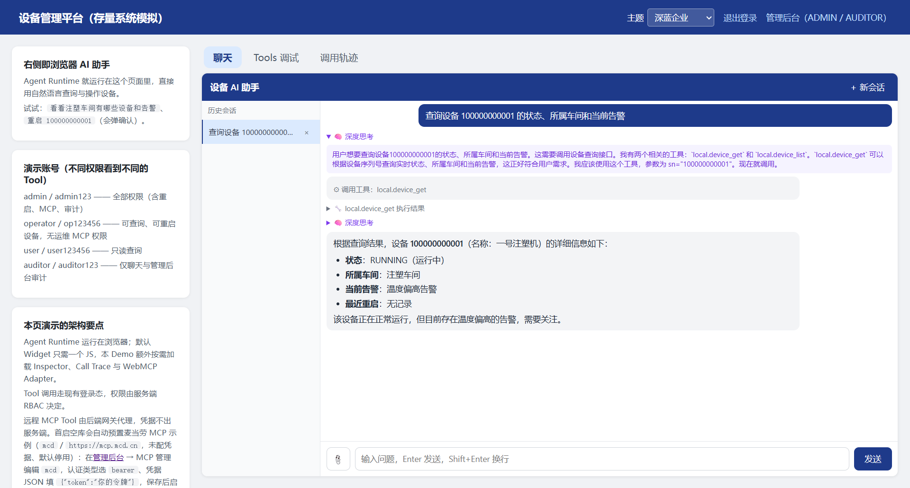
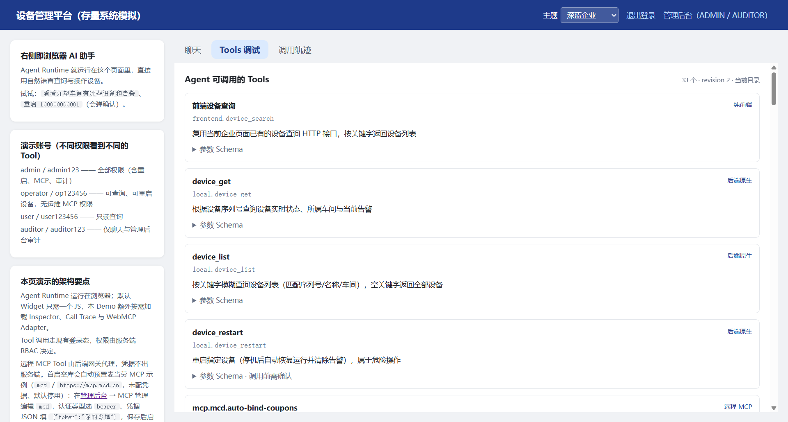
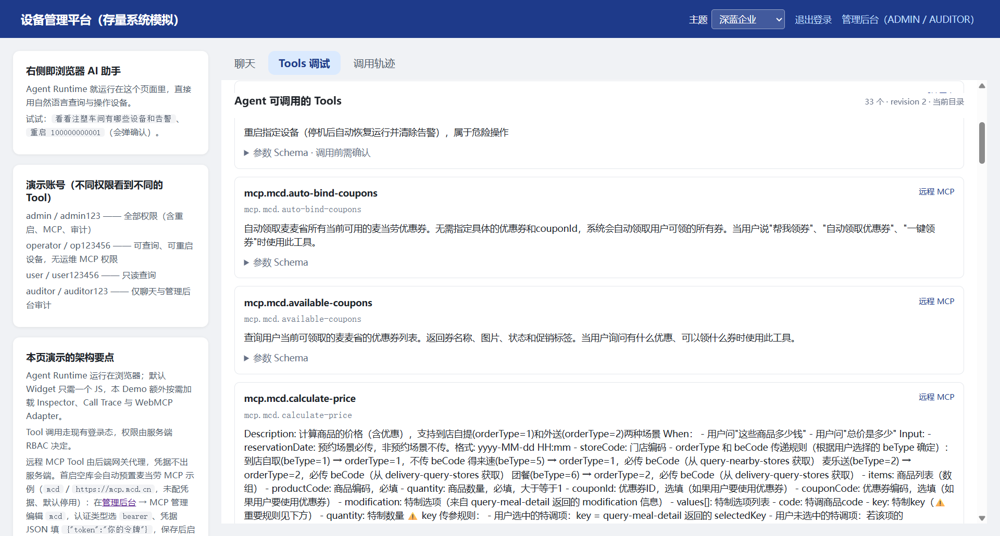
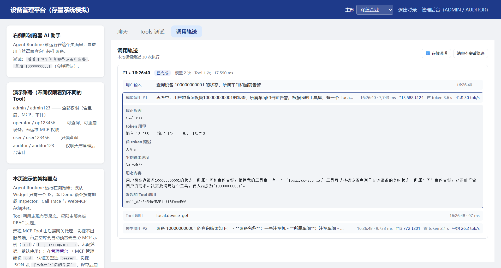
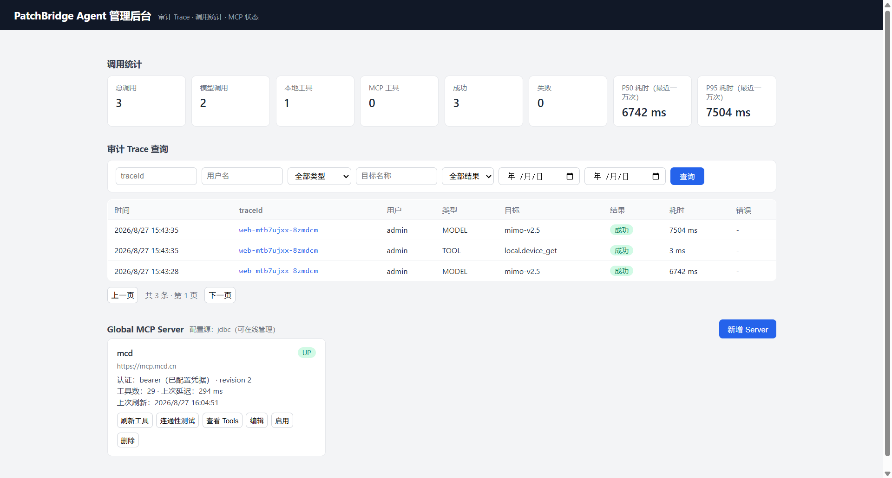
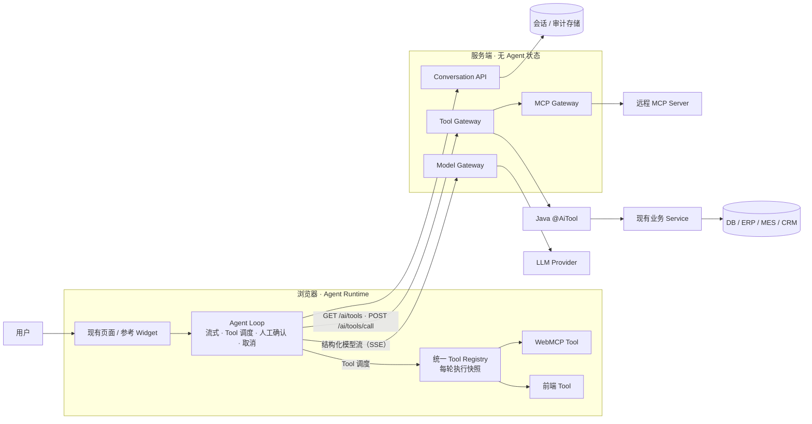
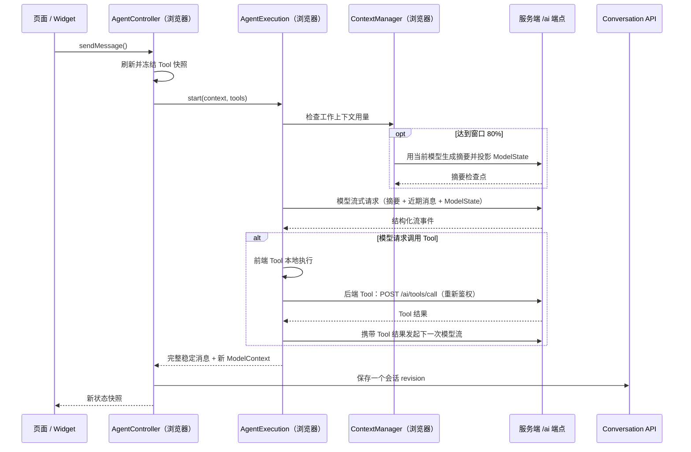

# PatchBridge Agent

[](LICENSE)


> **中文名：破补丁 Agent —— 为存量企业 Web 系统打造的轻量级 Agent 集成框架。**
>
> **Browser runs Agent. Server runs Business. LLM does Reasoning.**

> **项目状态：** v0.1 源码候选阶段（`v0.1.0-rc.2` 已冻结）。API 可能调整；Maven / npm 公共包尚未发布，当前从源码构建。见[当前状态与路线图](#当前状态与路线图)。

---

## 项目简介

PatchBridge Agent 让运行多年的 Java / Spring Boot 企业系统低成本获得 Agentic AI 能力。接入后，系统得到一个能操作真实业务的 AI 助手：用户用自然语言提出要求，Agent 调用现有的 Java 业务方法、前端页面函数和企业 MCP 服务完成任务。

三个核心设计：

- **纯客户端 Agent，服务端不保存任何 Agent 执行状态。** Agent Loop、Tool 调度、流式输出和人工确认（Human-in-the-loop）全部在用户浏览器中执行。服务端只处理短生命周期请求：转发模型调用、执行 Tool、保存会话、写审计。10,000 个在线用户对应的服务端 Agent 实例数是 0；扩容只需增加无状态副本，无需会话粘滞，无需同步 Agent 状态。
- **前端逻辑可直接注册为 Agent Tool。** 页面已有的 Service 函数、API 调用和组件状态，几行代码注册成 Tool，Agent 即可直接调用，无需为此新写后端接口。
- **一个注解接入后端能力，复用现有安全体系。** Java 业务方法加上 `@AiTool` 即成为 Tool；认证、RBAC、业务服务、数据库原样复用；Java Core 零 Spring 依赖，Java 8 / Spring Boot 2.x 存量系统可直接接入。

### 能力速览

| 能力 | 说明 |
| --- | --- |
| 浏览器 Agent Runtime | Agent Loop、流式输出、Tool 调度、人工确认、取消与资源上限全部在浏览器执行 |
| 后端 Tool 声明 | `@AiTool` 注解把 Java 方法变成 Tool，参数自动生成 JSON Schema |
| 前端 Tool 注册 | 页面函数注册为 Tool，直接复用前端 Service、页面状态和已有 API，不经过后端 Tool 端点 |
| WebMCP | 接入浏览器 `document.modelContext` 暴露的 Tool |
| 统一 Tool Registry | 四种 Tool 来源进入同一目录和命名空间；每轮执行使用不可变快照 |
| Model Gateway | 模型调用经后端转发，浏览器请求复用当前页面登录态；API Key 只存在服务端；内置 OpenAI-compatible Provider，可整体替换 |
| MCP Gateway | 企业接入的外部 MCP Server 由后端反向代理为统一 Tool，前端 Agent 直接调用；用户无需配置任何地址与凭据 |
| 上下文压缩 | 完整聊天历史始终保留；模型工作上下文在窗口 80% 自动压缩，也支持 Widget 手动建立检查点 |
| 会话持久化 | 完整消息与模型工作上下文（检查点、`ModelState`、usage）同一 revision 原子落库，跨设备恢复对话 |
| 审计与调试 | 服务端 Audit / Trace，浏览器 Tools Inspector 与 Call Trace |
| 参考 Widget | 开箱即用的 Web Component，三层样式定制，也可完全 Headless 自建 UI |

---

## 核心功能实拍

以下截图来自本地运行的 Demo（`admin` 账号视角），设备数据为 Demo 内置样例。

### 浏览器内 Agent Runtime 与 Tool Calling



用户用自然语言提问，Agent Loop 在浏览器中完成一轮完整执行：深度思考、Tool 调用与结果、最终回答依次流式渲染。图中模型选择的是 Java 后端 Tool `local.device_get`；Tool 调用携带当前登录态发往服务端，权限检查仍由原有安全体系执行。

### Unified Tool Registry 与 Tools Inspector



Tools Inspector 只读展示当前用户可调用的 Tool 快照：33 个 Tool 同时覆盖前端 Tool、Java 后端 Tool 和远程 MCP Tool 三种来源，共用同一个 `revision`；危险操作会明确标注“调用前需确认”。其中 29 个 MCP Tool 来自下一节的反向代理。

### MCP 反向代理远程 Tool



管理员在服务端配置并启用远程 MCP Server 后，MCP Gateway 把它反向代理成一组普通 Agent Tool：`mcp.mcd.*` 命名空间下的 29 个 Tool 进入同一目录，浏览器只看到统一的名称和参数 Schema，接触不到远程地址与凭据；协议通信和认证全部由服务端完成。

### Browser Call Trace



Call Trace 按 Execution 记录一次执行的完整过程：用户输入、每次模型调用与 Tool 调用、耗时，以及输入 / 输出 token、首 token 延迟等指标，用于复盘单次执行的每个环节。轨迹保存在浏览器本地，自动保留最近 30 次执行。

### Admin Console：审计与 Global MCP



Admin Console 把服务端调用统计、审计 Trace 查询和 Global MCP Server 管理放在同一个后台：管理员在线刷新、测试连通性、启停远程 MCP，审计记录给出每次模型 / Tool 调用的结果与耗时。图中 Demo 内置的示例 Server `mcd` 处于 `UP` 状态：Bearer 认证，29 个 Tool（`revision 2`）。凭据以密文保存在服务端，管理界面只显示认证类型与状态，不回显凭据本身。

## 它解决什么问题

存量企业系统接入 AI，通常同时遇到三个困难。

**技术栈被锁死。** 大量企业系统仍运行在 Java 8 + Spring Boot 2.x 上，升级意味着回归测试整个业务系统。Spring AI 这类主流 Java AI 框架要求 JDK 17 与 Spring Boot 3.x，对老系统不友好；接入 AI 的第一步变成了技术栈升级。

**安全与业务体系已经存在。** 登录、RBAC、租户隔离、审计在现有系统里已经过多年验证。为一个 AI 助手重建一套平行体系，成本高、风险大，审计口径也会分裂。

**服务端 Agent 的资源代价。** 常见的服务端 Agent 框架为每个在线用户维护执行状态：Agent Loop 进度、Checkpoint、等待用户确认的对象常驻内存。用户量上升后，还要解决节点间的状态同步、会话粘滞和故障恢复：

**新领域的学习成本。** AI Agent 开发带来一套全新的领域内容：编排框架、流式协议、Tool 体系、上下文与状态管理。存量团队为加一个 AI 助手，先要消化整套新概念，学习曲线本身就成了接入门槛。

```
为了给已有系统增加 Agent
        ↓
引入新的服务端 AI Runtime
        ↓
升级 JDK / Spring Boot
        ↓
重新处理认证、权限、Session、状态和并发
        ↓
AI 变成整个系统里最重的一层
```

PatchBridge Agent 换了一条路径：

```
保留现有业务后端与安全体系
        ↓
浏览器承担 Agent Runtime
        ↓
后端只增加无状态端点：模型代理、Tool 网关、MCP 代理、会话存储
```

---

## 设计目标

### 一、服务端无 Agent 状态

Agent Runtime 完整运行在浏览器中，包括：

- Agent Loop（模型与 Tool 的循环调度）
- 对话上下文与流式状态
- Tool 调度与每轮执行快照
- 人工确认等待
- 取消、超时和资源上限

服务端不保存任何跨请求的 Agent 执行状态：没有每用户的执行进度，没有常驻 Agent 实例，没有 Checkpoint 调度，没有等待确认的对象。服务端处理的都是短生命周期请求。

```
10,000 个在线用户
        =
10,000 个浏览器内的 Agent Runtime
        +
0 个服务端 Agent 实例
```

带来的直接收益：

- **Agent 并发压力从服务端移除。** 服务端看到的是普通 HTTP / SSE 请求；任意副本可服务任意请求，水平扩容无需会话粘滞，无需在节点间同步 Agent 状态。
- **运维简单。** 应用节点随时可以重启、发布、扩缩容，无需迁移或排空 Agent 状态。
- **容量规划与现状一致。** 框架不新增常驻内存消耗；真正的瓶颈仍是模型 API、数据库和下游业务系统的正常扩容与限流。

框架区分两个状态概念，"服务端无 Agent 状态"与"对话可跨设备恢复"同时成立：

| 状态 | 位置 | 生命周期 |
| --- | --- | --- |
| 执行状态（Runtime State）：当前执行到哪一步、正在流式输出的内容、等待中的确认 | 浏览器 | 页面关闭即消失 |
| 会话（Conversation）：完整消息历史与独立模型工作上下文 `ModelContext` | 服务端数据库 | 作为普通业务数据持久化 |

用户换一台设备登录，加载历史会话即可继续对话。v0.1 的边界：执行中断后从最后一次成功保存的完整对话状态继续，不恢复执行到一半的运行；服务端因此永远不需要 Checkpoint 和工作流状态机。

### 二、低侵入集成

**Java 侧：一个注解。**

```java
@AiTool(
    name = "device_get",
    description = "根据设备序列号查询设备信息",
    readOnly = true
)
public DeviceDTO getDevice(
        @AiParam(name = "sn", value = "设备序列号", required = true) String sn) {
    return deviceService.getBySn(sn);
}
```

方法体就是原有业务调用。框架负责扫描注解、生成 JSON Schema、注册进统一 Tool 目录。

**前端侧：几行代码。**

```js
agent.registerTool({
  name: 'frontend.order_search',
  description: '调用当前系统已有的订单查询接口',
  inputSchema: {
    type: 'object',
    properties: { keyword: { type: 'string' } },
    additionalProperties: false
  },
  annotations: { readOnlyHint: true },
  execute: async ({ keyword }) => {
    const response = await enterpriseFetch(
        `/api/orders?keyword=${encodeURIComponent(keyword ?? '')}`);
    return response.json();
  }
});
```

`execute` 直接复用页面已有的 Service、请求客户端和组件状态。前端 Tool 在浏览器本地执行，不经过 `/ai/tools/call`；涉及服务端数据时仍调用原有 API，沿用原有鉴权。

**企业决策通过 Port 替换，不需要 Fork。**

身份、权限、会话归属、存储、审计、模型来源都是框架定义的扩展点（Port），Starter 提供默认实现，宿主应用注册自己的 Bean 即可整体替换：

| 扩展点 | 宿主决定什么 |
| --- | --- |
| `CurrentUserProvider` | 从现有登录体系解析可信用户 |
| `ToolAccessPolicy` | Tool 的发现与调用权限（对接现有 RBAC / ABAC） |
| `ConversationOwnerResolver` | 多租户下的会话归属键 |
| `ConversationRepository` | 会话存储（默认 JDBC，支持 H2 / MySQL） |
| `AuditSink` / `AuditRedactor` | 审计落地位置与脱敏规则 |
| `ModelProvider` | 模型来源（默认 OpenAI-compatible） |

技术栈约束：Java Core 只依赖 JDK 8，零 Spring 依赖；Spring Boot 2 Starter 是适配层，负责自动装配和默认实现。存量系统不用为接入 AI 升级 JDK 或 Spring Boot。

学习成本同样被收敛：开发者面对的是一个注解和几行注册代码；Agent Loop、流式输出、人工确认、取消这些 Agent 领域的运行时复杂度由框架承担，存量团队用现有的 Controller / Service / 页面组件经验即可完成接入。

### 三、安全边界留在服务端

浏览器不是安全边界。页面隐藏按钮、Tool 描述里的约束，都拦不住模型发起调用；真正的检查全部发生在服务端。

每一次 Tool 调用都经过完整链路：

```
浏览器发起 Tool Call
      ↓
宿主认证
      ↓
CurrentUserProvider 解析可信用户
      ↓
ToolAccessPolicy 调用鉴权
      ↓
宿主业务 ACL
      ↓
执行 Tool
```

配套规则：

- `userId`、`tenantId`、`roles` 等可信上下文由服务端从登录态获取并注入，不进入模型可生成的 Tool 参数 Schema，模型无法伪造。
- `/ai/tools` 只返回当前用户可发现的 Tool；`/ai/tools/call` 每次调用重新执行 `canInvoke`，发现过滤不替代调用鉴权。
- 模型 API Key 只存在服务端配置；MCP 凭据 AES-256-GCM 加密落库，管理接口不回显。
- 浏览器用户的登录凭据默认不转发给第三方 MCP Server。
- 写操作 Tool 可要求人工确认；前端 Tool 未声明只读时默认要求确认。

---

## 应用场景与边界

适合：

- 在 ERP / MES / CRM / OA / 运维平台 / IoT 设备管理中加入自然语言业务助手
- 在存量 Java / Spring Boot 项目中低成本加入 Tool Calling
- 需要严格复用现有认证、权限和审计口径的企业 Copilot

当前不覆盖（详见[路线图](docs/roadmap.md)与[版本说明](docs/releases/v0.1/release-notes.md)）：

- 浏览器关闭后仍需持续运行的后台 Agent、定时 Agent
- Durable Workflow、Checkpoint 恢复、复杂 Multi-Agent 编排
- Coding Agent、Deep Research、通用 RAG 平台

这些智能体形态自带庞大的运行时设计：后台长任务、Checkpoint、多智能体编排都需要常驻的服务端执行状态，属于重型 Agent 平台的领域。PatchBridge Agent 保持轻量，定位是让存量系统以最低成本先把 Agent 能力用起来；在此前提下持续收紧执行边界、完善资源上限与可观测性，让单轮交互能承载更复杂的业务任务。

---

## 架构

### 总览



### 职责划分

| 浏览器负责 | 服务端负责 |
| --- | --- |
| Agent Loop 与 Tool 调度 | 认证与授权（复用宿主体系） |
| 对话上下文与流式状态 | Tool 发现与执行（每次调用重新鉴权） |
| 人工确认等待 | 模型代理（API Key 只存在服务端） |
| 取消与资源上限 | MCP 代理与凭据加密 |
| 前端 Tool / WebMCP 本地执行 | 会话持久化（owner 隔离）与审计 |

服务端明确不承担：长驻 Agent 实例、每用户执行状态、Agent Workflow 状态机、Checkpoint 调度、后台长期运行的 Agent、Multi-Agent Runtime。

### 统一 Tool Registry

Agent 面对一个统一目录，四种来源进入同一命名空间：

| 来源 | 命名空间示例 | 执行位置 |
| --- | --- | --- |
| Java `@AiTool` | `local.device_get` | 服务端（经 `/ai/tools/call`，重新鉴权） |
| 后端代理的远程 MCP Server | `mcp.inventory.query_stock` | 服务端代理转发 |
| 前端 Tool | `frontend.order_search` | 浏览器本地 |
| WebMCP（`document.modelContext`） | `page.open_tools_tab` | 浏览器本地 |

两条核心规则：

- **重名直接失败。** 不同来源注册同名 Tool 时明确报错，没有按来源优先级静默覆盖。Tool 名称会进入模型 Schema、RBAC、审计和会话历史，命名空间从第一版开始保持稳定。
- **每轮执行使用不可变快照**（Tool Registry 执行快照，`ToolRegistrySnapshot`）。一轮对话开始前刷新并冻结一份快照：模型看到的 Tool 定义、实际调用的路由、Inspector 展示的列表来自同一份数据；执行中的注册、注销和远程刷新只影响下一轮。

远程 MCP Server 由企业管理员在服务端统一配置（地址、凭据、启停），MCP Gateway 把这些外部服务反向代理为统一目录中的 Tool，前端 Agent 直接调用。普通用户打开页面即可使用，无需配置任何 endpoint 和 Token；浏览器不直接连接 MCP Server。

### 一次对话的执行流程



每轮执行是一个独立 `AgentExecution`，拥有独立的取消信号、人工确认中断槽和资源上限（模型次数、Tool 次数、整轮时长、内容量五项预算）。用户停止执行时，取消会同时传递给上下文摘要、模型流、前端 Tool 和后端 Tool 请求。执行细节见[Runtime 契约参考](docs/reference/runtime-contracts.md)。

### 模块组成

Java（Maven 多模块，父坐标 `io.patchbridge.agent:patchbridge-agent-parent`）：

| 模块 | 职责 |
| --- | --- |
| `patchbridge-agent-annotations` | 零依赖的 `@AiTool` / `@AiParam` 注解 |
| `patchbridge-agent-core` | 领域模型、Port 与调用管线（不依赖 Spring） |
| `patchbridge-agent-model-openai` | OpenAI Chat 协议内核 |
| `patchbridge-agent-model-webflux` | 可选 WebFlux Provider Adapter（完全 opt-in） |
| `patchbridge-agent-storage-jdbc` | 会话、审计与 MCP 配置的 JDBC Adapter（H2 / MySQL） |
| `patchbridge-agent-mcp` | Global MCP 配置、远程客户端与 Tool Provider |
| `patchbridge-agent-spring-boot2-starter` | 自动装配、HTTP 端点与默认实现 |
| `patchbridge-agent-demo` | 模拟"企业设备管理系统"的完整接入示例 |

前端（workspace，五个包）：

| 包 | 职责 |
| --- | --- |
| `@patchbridge-agent/agent` | Headless 核心：AgentController、状态机、Runtime、HTTP Client |
| `@patchbridge-agent/widget` | 参考 Web Component UI |
| `@patchbridge-agent/webmcp-adapter` | `document.modelContext` 适配 |
| `@patchbridge-agent/tool-inspector` | Tool 只读检查器 |
| `@patchbridge-agent/call-trace` | 调用轨迹视图 |

Widget 通过 Starter 内置的前端产物加载，宿主无需 Node 工具链。完整的六边形架构、设计模式与架构不变量见[架构总览](docs/architecture/overview.md)。

---

## 快速开始

当前公共包尚未发布，两种起步方式：

- 只想看效果：直接[运行 Demo](#运行-demo)。
- 接入宿主应用：先按 [QUICKSTART](QUICKSTART.md) 从源码构建安装，再走下面四步。

### 1. 引入依赖

```xml
<dependency>
    <groupId>io.patchbridge.agent</groupId>
    <artifactId>patchbridge-agent-spring-boot2-starter</artifactId>
    <version>0.1.0-SNAPSHOT</version>
</dependency>
```

引入即获得 `/ai/**` Agent 端点、`/ai/assets/**` 前端产物与可替换的默认实现。Admin 管理端默认关闭，不会向宿主暴露管理界面。

### 2. 配置模型

```yaml
patchbridge-agent:
  model:
    base-url: https://api.your-llm.com/v1   # OpenAI-compatible
    model: your-model
    api-key: ${PATCHBRIDGE_AGENT_MODEL_API_KEY}   # 环境变量注入，浏览器拿不到
    context-window-tokens: 128000   # 必须与所选模型真实窗口一致
```

会话与审计默认经 JDBC 存储（H2 / MySQL）。远程 MCP 为可选项，在 `patchbridge-agent.mcp` 下配置。完整配置项见[配置参考](docs/reference/configuration.md)，逐步接入见[Spring Boot 接入指南](docs/guides/spring-boot-integration.md)。

### 3. 声明后端 Tool

在现有 Service 或 Controller 上加注解：

```java
@AiTool(
    name = "device_get",
    description = "根据设备序列号查询设备信息",
    readOnly = true
)
public DeviceDTO getDevice(
        @AiParam(name = "sn", value = "设备序列号", required = true) String sn) {
    return deviceService.getBySn(sn);
}
```

### 4. 注册前端 Tool 并挂载助手

```html
<script src="/ai/assets/patchbridge-agent.js"></script>
<patchbridge-agent id="agent" endpoint="/ai"></patchbridge-agent>
<script>
  const agent = document.getElementById('agent');
  let registration;

  agent.addEventListener('patchbridge-agent-ready', () => {
    registration?.dispose();
    registration = agent.registerTool({
      name: 'frontend.order_search',
      description: '调用当前系统已有的订单查询接口',
      inputSchema: {
        type: 'object',
        properties: { keyword: { type: 'string' } },
        additionalProperties: false
      },
      annotations: { readOnlyHint: true },
      execute: async ({ keyword }) => {
        const response = await enterpriseFetch(
            `/api/orders?keyword=${encodeURIComponent(keyword ?? '')}`);
        if (!response.ok) {
          throw new Error(`订单查询失败：HTTP ${response.status}`);
        }
        return response.json();
      }
    });
  });
</script>
```

`enterpriseFetch` 代指页面已有的请求客户端（含 Cookie、CSRF、Token 刷新）。`inputSchema` 由 Registry 在注册期编译、在统一执行边界强制校验模型参数，Tool 内部无需重复做参数检查。

打开页面即可对话。Widget 会在模型工作上下文达到窗口 80% 时自动压缩，并在顶栏提供手动
入口；完整聊天历史不会删除。也可以完全不用 Widget，直接订阅 Headless Controller 的状态
自建 UI，见[浏览器接入指南](docs/guides/browser-integration.md)和
[上下文压缩指南](docs/guides/context-compaction.md)。

### 运行 Demo

Demo 模拟一个"企业设备管理系统"：Spring Security 表单登录、四个角色（RBAC 直接影响后端 Tool 可见性）、本地 Tool 与 Global MCP 管理。

```bash
cd java
# JDBC MCP 凭据密钥必须显式注入（生成：openssl rand -base64 32）
export PATCHBRIDGE_AGENT_MCP_ENCRYPTION_KEY='<32 字节密钥的 Base64>'
# 工具版本使用独立密钥；同一部署的所有实例共享
export PATCHBRIDGE_AGENT_MCP_TOOL_VERSION_KEY='<另行生成的 32 字节密钥的 Base64>'
# 模型地址与名称必须显式配置
export PATCHBRIDGE_AGENT_MODEL_BASE_URL='https://api.your-llm.com/v1'
export PATCHBRIDGE_AGENT_MODEL='your-model'
export PATCHBRIDGE_AGENT_MODEL_CONTEXT_WINDOW_TOKENS='128000'
mvn install -DskipTests
mvn -pl patchbridge-agent-demo spring-boot:run
```

| 入口 | 地址 |
| --- | --- |
| 企业系统首页（含 AI 助手） | http://localhost:8080/ |
| 管理后台（审计 Trace / Global MCP 配置） | http://localhost:8080/ai-admin/ |
| 登录账号 | admin/admin123、operator/op123456、user/user123456、auditor/auditor123 |

从零构建、角色差异与逐项验收见 [QUICKSTART](QUICKSTART.md)与[Demo 验收指南](docs/guides/demo-validation.md)。

---

## 安全模型

几条从第一版就固定的原则：

1. 浏览器不是安全边界，全部授权检查在服务端执行。
2. `/ai/tools` 只返回当前用户可发现的 Tool；`/ai/tools/call` 每次调用重新执行 `canInvoke`。
3. `userId`、`tenantId`、`roles` 等可信上下文由服务端从登录态注入，模型参数无法伪造。
4. 模型 API Key 与 MCP 凭据只存在服务端；MCP 凭据 AES-256-GCM 加密落库，管理接口不回显凭据。
5. 浏览器用户的登录凭据默认不转发给第三方 MCP Server。
6. 写操作 Tool 可要求人工确认；前端 Tool 未声明只读时默认要求用户确认。
7. Tool 默认不自动重试，避免非幂等操作重复执行。
8. 审计与会话数据分开保存；审计 payload 默认 `metadata-only`，未配置脱敏器时强制写入 `[REDACTED]`。
9. Admin Console 默认关闭，开启需要同时显式设置 `patchbridge-agent.admin.enabled=true` 并提供 `AdminAccessPolicy` Bean。

生产上线检查清单与故障处理见[生产接入指南](docs/guides/production-readiness.md)。

---

## 与 Spring AI / LangGraph / MCP 的关系

**Spring AI** 在 Spring 后端内构建 AI 应用能力，适合较新的 Spring 技术栈和新项目。PatchBridge Agent 面向存量系统集成：Agent Runtime 在浏览器、后端保持无 Agent 状态、Java 8 / Spring Boot 2.x 可用。两者切入点不同。

**LangGraph 等 Workflow 框架**擅长 Graph Workflow、Checkpoint、Durable Execution 和长时间运行的后台 Agent，这些能力依赖服务端执行状态。PatchBridge Agent 面向交互式 Web Copilot：用户在场、会话实时、执行随页面生命周期结束。

**MCP** 是 Tool 与上下文的标准协议，PatchBridge Agent 把它作为 Tool 来源之一：企业管理员在服务端配置 MCP Server 与凭据，MCP Gateway 把远程 Tool 转换为统一目录中的 Tool，浏览器无需直接连接 MCP Server。浏览器侧同时支持 WebMCP（`document.modelContext`）。

---

## 当前状态与路线图

- v0.1 核心链路已完成并冻结源码候选 `v0.1.0-rc.2`；当前源码在该基线后完成 R1.7 上下文压缩，包含完整历史与工作上下文分离、80% 自动触发和手动入口。
- Pre-release：API 可能调整，模块边界可能优化；Maven / npm 未发布公共仓库；不建议直接用于关键生产系统。
- 实施进度、下一步顺序与暂缓范围只以[《路线图与当前进度》](docs/roadmap.md)为准；版本边界与已知限制见[《v0.1 版本说明》](docs/releases/v0.1/release-notes.md)。

---

## 文档

| 任务 | 文档 |
| --- | --- |
| 第一次运行 | [快速开始](QUICKSTART.md)、[从源码构建](docs/guides/build-from-source.md) |
| 后端接入 | [Spring Boot 接入指南](docs/guides/spring-boot-integration.md)、[Java Tool 开发](docs/guides/java-tools.md)、[后端单次模型调用](docs/guides/java-model-invocation.md) |
| 浏览器接入 | [浏览器接入指南](docs/guides/browser-integration.md)、[上下文压缩](docs/guides/context-compaction.md)、[前端 Tool](docs/guides/frontend-tools.md)、[WebMCP Adapter](docs/guides/webmcp.md)、[Widget 定制](docs/guides/widget-customization.md) |
| MCP 与管理 | [Global MCP 与 Admin](docs/guides/global-mcp.md) |
| 调试 | [Tools Inspector](docs/guides/tools-inspector.md)、[Call Trace](docs/guides/call-trace.md) |
| 生产上线 | [生产接入准备与排障](docs/guides/production-readiness.md) |
| 契约参考 | [Starter 配置](docs/reference/configuration.md)、[HTTP 与 SSE 契约](docs/reference/http-api.md)、[Browser API](docs/reference/browser-api.md)、[Runtime 契约](docs/reference/runtime-contracts.md)、[错误码](docs/reference/error-codes.md) |
| 架构与决策 | [架构总览](docs/architecture/overview.md)、[ADR 索引](docs/architecture/adr/README.md) |
| 全部文档 | [文档中心](docs/README.md) |

---

## Contributing

项目处于早期阶段，方向和边界优先于功能堆叠。欢迎通过 Issue / Discussion 讨论设计，特别是这些方向：

- Browser-side Agent Runtime
- 企业 Tool Gateway 与 Tool 安全
- 存量 Java / Spring Boot 系统集成
- 现有 RBAC 集成
- MCP Gateway 与 Agent 可观测性

API 稳定之前，大的设计改动建议先对齐边界，再进入实现。

---

## 致谢

感谢 [yike-citing](https://github.com/yike-citing) 为本项目提供了数以亿计的 token，加速了本项目的开发与想法验证。

---

## License

本项目采用 [MIT License](LICENSE)。Demo 中 vendored 前端资源的来源与许可证见 [Third-Party Notices](THIRD_PARTY_NOTICES.md)。
