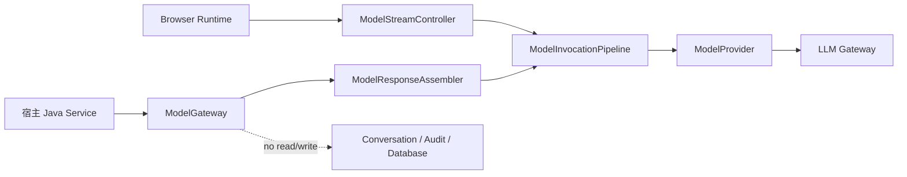

# Java 后端单次模型调用 API 设计

- 文档状态：已实现并通过 R1 验收
- 目标里程碑：R1
- 最近更新：2026-08-24
- 适用范围：Java 8 Core、Spring Boot 2 Starter、Model Provider Adapter 与 Demo

## 1. 背景

PatchBridge Agent 当前把 Agent Loop 放在 Browser Runtime，Java 后端只提供 Model、Tool、
Conversation 和 MCP 等安全边界。这不代表 Java 业务代码不需要调用模型。内容审核、图片
审核、文本分类、摘要和信息抽取等后端用例通常只需要：

```text
构造一次模型请求
  → 调用已配置的模型网关
  → 获得一个完整结果
  → 由宿主业务决定如何使用
```

这个用例不需要 Agent Loop、Tool 自动调度、Conversation 或跨请求执行状态。当前
`ModelProvider` 和 `ModelInvocationPipeline` 已经表达了厂商中立的单次模型调用，缺少的
是适合宿主 Java Service 直接使用的入站门面和完整结果聚合器。

## 2. 核心决策

### 2.1 单次调用语义

“单次”表示每次入站调用最多发起一次 `ModelProvider` 请求。模型响应完成、失败、超时或
取消后，该调用立即终止。框架不会：

- 根据模型结果再次调用模型；
- 自动执行 Tool Call；
- 创建、更新或恢复 Conversation；
- 创建等待 Human-in-the-loop 的中断对象；
- 在 JVM 中保留跨请求 Agent Execution。

因此，该能力不改变“Agent Loop 只在 Browser Runtime”的架构不变量。

### 2.2 默认零持久化、零调用记录

一次 Java 调用只在内存中保留完成当前请求所需的短生命周期对象：不可变 `ModelRequest`、
正在聚合的内容块、完成结果或异常，以及上游取消句柄与单次终止状态。终止后框架释放组装
中间态；返回给调用者的 `ModelResponse` 由调用者决定保留多久。

默认实现不读写 `ConversationRepository`，不写入 `AuditSink` 或 Admin Trace，不建表、
不落库，也不向文件、本地缓存或进程级集合写入调用历史。框架仍可记录不含请求、响应
正文的必要错误日志。

### 2.3 保存是宿主业务责任

调用者拿到不可变 `ModelResponse` 后，可以在自己的 Service 中按业务事务保存：

```java
ModelInvocation invocation = modelGateway.invoke(request, context);
invocation.result().thenAccept(response -> reviewRepository.save(toReview(response)));
```

框架不提供默认的 `ModelResponseRepository`，调用成功后也不会隐式触发存储。宿主如需对所有
Java 单次调用做横切处理，可以显式包装 `ModelGateway` 或注册 `ModelCallInterceptor`。

### 2.4 复用现有流式 Provider 协议

公共 Java API 向调用者返回完整结果，但默认 Provider 可以继续使用现有异步 SSE 协议，
由 `ModelResponseAssembler` 在当前调用内聚合结构化事件。这样可以：

- 复用已验证的 Provider 协议解码和取消语义；
- 每个 Provider 只维护一套解析，不需要同时实现 streaming / non-streaming；
- 保持 `ModelProvider` 的小接口；
- 以后在 Provider 内做非流式优化时，不改变宿主 Java API。

### 2.5 第一版是同 JVM API

目标用法是宿主引入 Maven 依赖后，在同一个 Spring 应用中注入 Java Bean。宿主不应通过
HTTP 请求自己的 `/ai/model/stream`。

如果将来需要跨服务调用模型网关，应单独设计服务间认证、配额与幂等，并使用专用 HTTP
Client，不复用浏览器 SSE 端点。

## 3. 目标与非目标

### 3.1 第一版目标

- 宿主 Java Service 可以用一个稳定 Bean 发起单次模型调用；
- 支持文本、图片 URL 和 Base64 图片输入；
- 支持异步结果、阻塞便捷等待、超时与主动取消；
- 返回厂商中立的完整 `ModelResponse`；
- 复用 `ModelProvider`、`ModelInvocationPipeline` 和 `ModelCallInterceptor`；
- Starter 默认自动装配，宿主同类型 Bean 可以替换；
- Java 8、默认 OkHttp Provider 与可选 WebFlux Provider 共用同一 Core 契约。

### 3.2 第一版非目标

- 不实现后端 Agent Loop 或自动 Tool 调度；
- 不读写 Conversation，不记录 Java 单次调用的 Audit / Trace；
- 不提供调用历史查询、数据表或管理页面；
- 不内置内容审核规则、提示词、风险等级或业务 DTO；
- 不封装厂商专用的 Moderation API；
- 不实现远程 Java SDK 或新的服务间 HTTP 端点；
- 不提供自动 JSON Schema 输出约束或宿主 DTO 反序列化。

## 4. 目标架构



| 组件 | 职责 | 禁止承担 |
| --- | --- | --- |
| `ModelGateway` | Java 入站门面，创建单次调用 | 厂商协议、会话、存储、Agent Loop |
| `ModelInvocation` | 暴露结果、等待和取消 | 全局任务管理、调用历史 |
| `ModelResponseAssembler` | 校验事件序列并聚合完整响应 | 发起第二次调用、执行 Tool |
| `ModelInvocationPipeline` | Interceptor 顺序、Provider 调用和终止语义 | HTTP DTO、JDBC 和业务规则 |
| `ModelProvider` | 厂商请求编码、流解码和上游取消 | Java 业务用例和持久化 |

`ModelGateway` 是 Java 宿主调用的入站 Port；`ModelProvider` 是通往模型厂商的出站 Port。
两者不能合并，否则会让宿主代码直接依赖厂商传输细节。

## 5. 公共契约

### 5.1 ModelGateway

建议在 Core 增加小而稳定的入站 Port：

```java
public interface ModelGateway {
    ModelInvocation invoke(ModelRequest request);

    ModelInvocation invoke(ModelRequest request, AiRequestContext context);
}
```

- `invoke(request)` 用于可信 JVM 内部 Service，只创建临时 trace ID，不从
  Web SecurityContext 猜测身份；
- `invoke(request, context)` 用于需要把用户、租户或宿主链路信息交给 Interceptor 的场景；
- 两个入口都严格校验请求，不接受 `null`；
- 两个入口都不读取 `CurrentUserProvider`：后台线程中没有 Web 登录态，需要用户或租户上下文时通过 `context` 显式传入。

### 5.2 ModelInvocation

```java
public interface ModelInvocation {
    CompletionStage<ModelResponse> result();

    ModelResponse await(Duration timeout);

    void cancel();
}
```

- `result()` 是不阻塞的主契约；
- 每次 `result()` 返回独立观察投影；调用方通过 `toCompletableFuture()` 做本地
  `complete/cancel` 不得改写 Invocation 内部终态、取消上游或污染其他观察者；
- `await(timeout)` 是明确由宿主选择的阻塞便捷方法；
- `cancel()` 必须幂等并取消真实上游 `ModelCall`；
- 等待超时时先取消上游，再报告明确超时异常；
- 线程被中断时取消上游、恢复中断标记，然后返回明确失败；
- 终止后不得接受迟到事件或改写已完成结果。

公共类型不暴露 Reactor、OkHttp 或 Servlet。

### 5.3 ModelResponse

```java
public final class ModelResponse {
    private final AgentMessage message;
    private final ModelStopReason stopReason;
    private final ModelUsage usage;
    private final ModelState modelState;
}
```

`ModelResponse` 必须是深度不可变值对象。它保留结构化块，不把 reasoning、普通文本和后续
模型状态压成一个字符串。

`getText()` 便捷方法按顺序拼接 `TextBlock`，不包含 `ReasoningBlock`。文本到宿主 DTO
的转换由宿主完成，Core 不为此引入 Jackson。

### 5.4 ModelRequest 便捷构建

现有 `ModelRequest` 不需要第二套后端 DTO。为降低调用成本，可以增加 Builder 或静态工厂：

- System 文本消息；
- User 文本消息；
- User 图片 URL；
- User Base64 图片与媒体类型；
- 可选模型、temperature 和 maxTokens。

工厂只构建已有 `AgentMessage + ContentBlock`。

## 6. 结果聚合与 Tool 边界

`ModelResponseAssembler` 只消费 Provider 已归一化的结构化事件，不解析任何厂商原始字段。
聚合必须遵守：

1. `block-start` 使用尚未出现的非负 index；
2. `block-delta` 引用已开始且未停止的同类型块；
3. `block-stop` 精确关闭一个已开始块；
4. `message-stop` 只能出现一次，且所有块已经关闭；
5. `onCompleted` 前必须收到唯一 `message-stop`；
6. 未知事件、索引冲突、类型冲突和重复终止一律明确失败。

第一版 Java 单次 API 不执行 Tool，Core 也因此不需要 JSON 解析依赖：

- 请求携带非空 `request.tools` 时，`ModelGateway` 直接拒绝；
- Provider 在没有 Tool 定义时仍返回 tool-call 块，按协议错误失败；
- 将来确认“后端单次 Tool 请求、由宿主调度”的需求后，再增加专门的 JSON Object Decoder Port。

## 7. 生命周期、取消与内存

```text
CREATED → RUNNING → SUCCEEDED
                  ├→ FAILED
                  └→ CANCELLED
```

实现必须使用一个线性化终止门，保证事件发布、正常完成、失败、超时和取消之间只有一个获胜
者。该实现建立在 R0 取消/事件竞态修复之上，延续同一串行化模式，避免“先检查、后发布”
的竞态窗口。

内存约束：

- 每个聚合器和取消句柄只属于一个 `ModelInvocation`；
- 不存入 static Map、单例队列或进程级历史；
- 完成、失败、取消、超时或中断后都清理中间 `StringBuilder`、listener、Invocation 反向
  引用和上游句柄引用，不依赖 Provider 在取消后主动释放 listener；
- 输出上限由 `maxTokens` 与 Provider 显式约束，不在聚合器里静默截断；
- Base64 图片不在门面内建立持久副本，其大小由调用者和 Provider 明确约束。

## 8. 异常语义

| 场景 | 行为 |
| --- | --- |
| 参数或请求不变量错误 | `invoke` 同步抛出明确参数异常 |
| Provider 启动失败 | `invoke` 同步抛出 `ModelGatewayException` |
| 网络或厂商协议异步失败 | `result` 异常完成 |
| 结构化事件序列非法 | 取消上游，以不可重试协议错误结束 |
| 宿主主动取消 | 取消上游，以 `CancellationException` 结束 |
| `await` 超时 | 先取消上游，再抛出明确超时异常 |
| `await` 线程中断 | 取消上游并恢复线程中断标记 |

框架不自动重试；超时后不返回部分结果，Provider 失败也不切换其他模型。

## 9. Spring Boot Starter 装配

Starter 增加 `@ConditionalOnMissingBean(ModelGateway.class)` 默认 Bean，依赖已有
`ModelInvocationPipeline`。装配必须满足：

- 不要求 Servlet request 或 Spring SecurityContext 存在；
- 可以在 Controller、Service、定时任务或消息消费线程中使用；
- 宿主提供自定义 `ModelGateway` Bean 时默认实现完全让位；
- 不新增 Controller、数据表或管理页面；
- 不依赖 `ConversationRepository`、`AuditRecorder` 或 `AuditSink`；
- 默认 OkHttp Provider 和显式选择的 WebFlux Provider 使用方式一致。

## 10. 使用示例

以下只表达目标 API 形状，具体工厂命名在实现阶段由编译契约测试固定。

### 10.1 文本调用

```java
@Service
public class ContentReviewService {
    private final ModelGateway modelGateway;

    public ContentReviewService(ModelGateway modelGateway) {
        this.modelGateway = modelGateway;
    }

    public String review(String content) {
        ModelRequest request = ModelRequests.builder()
                .systemText("按企业自己的规则审核输入内容。")
                .userText(content)
                .maxTokens(300)
                .build();

        return modelGateway.invoke(request)
                .await(Duration.ofSeconds(20))
                .getText();
    }
}
```

提示词和业务规则由宿主定义。

### 10.2 图片调用

```java
ModelRequest request = ModelRequests.builder()
        .systemText("根据业务规则检查图片内容。")
        .userText("请返回检查结果。")
        .userImage(ImageSource.url(imageUrl))
        .maxTokens(300)
        .build();

ModelInvocation invocation = modelGateway.invoke(request, context);
invocation.result().thenAccept(this::handleReviewResult);
```

### 10.3 宿主自行保存

```java
modelGateway.invoke(request, context)
        .result()
        .thenAccept(response -> {
            // 是否保存、保存什么以及使用哪个事务，全部由宿主决定。
            reviewRepository.save(toReviewResult(response));
        });
```

## 11. Demo 设计

Demo 必须提供明确、可观察的后端示例，但不把 Demo 业务反向放入框架：

- Demo Service 注入 `ModelGateway`；
- 已认证 Demo Controller 在 Servlet 请求线程中通过宿主 `CurrentUserProvider` 固化可信
  `UserContext + traceId`，再显式传入 `AiRequestContext`；
- 文本入参示例发起一次真实模型调用；
- 图片 URL 或 Base64 入参示例覆盖多模态请求；
- 图片端点使用 60 秒 `DeferredResult`，将 Servlet 超时、异步错误和完成绑定到幂等
  `ModelInvocation.cancel()`；文本同步示例保持 20 秒显式等待；
- Demo 只把结果返回给调用方，不写 Conversation 或 Audit 表；
- 文档说明宿主如何自行保存结果，但 Demo 默认不启用保存；
- 不引入 Mock Model Server，使用宿主显式配置的真实模型网关验收。

Demo 的重点是展示后端 Service 如何调用 `ModelGateway`。

## 12. 测试与验收

### 12.1 Core 单元测试

- 文本和 reasoning 多块按 index 与事件顺序正确聚合；
- `message-stop` 的 stopReason、usage 和 modelState 无损保留；
- 未开始即 delta、重复 start/stop、类型冲突和缺少 `message-stop` 明确失败；
- 非空 Tool 定义和意外 tool-call 明确拒绝；
- 完成、失败、同步启动失败和取消都只有一个终止结果；
- 事件发布与取消并发时不会在终止后修改结果；
- `await` 超时和线程中断会取消真实 `ModelCall`；
- `getText()` 不混入 reasoning 内容。

### 12.2 Starter 集成测试

- 引入 Starter 后可注入唯一默认 `ModelGateway`；
- 宿主自定义 `ModelGateway` Bean 使默认实现让位；
- 没有 Servlet request 和 SecurityContext 时仍能在后台线程调用；
- OkHttp 与可选 WebFlux Provider 生成一致 `ModelResponse`；
- Java 单次调用不访问 `ConversationRepository`；
- Java 单次调用不访问 `AuditSink`；
- 取消和超时真实关闭上游连接；
- 现有 Browser SSE 与浏览器审计行为不受影响。

### 12.3 完成条件

路线图只能在以下条件全部满足时将该能力标记为已完成：

1. Core 契约、默认实现和 Starter 自动装配落地；
2. 文本、图片、异步、阻塞、超时、取消和失败路径关键测试通过；
3. 专项测试证明默认不保存 Conversation、Audit、请求、响应或调用历史；
4. 《文档中心》包含设计理念、文本/图片使用和宿主自行保存示例；
5. Demo 有可观察的 Java Service 调用示例，并经真实模型网关验证；
6. Java 8 全量测试、Starter 集成测试与现有 Browser 回归验证通过；
7. 路线图、架构文档、文档中心/Guide/Reference 和 Demo 说明同步到真实实现。

## 13. 推荐实施顺序

1. 先完成 R0 的 `ModelInvocationPipeline` 取消/事件线性化修复；
2. 在 Core 增加 `ModelResponse`、`ModelInvocation` 和事件聚合器；
3. 增加 `ModelGateway` 入站 Port 与默认实现；
4. 在 Starter 自动装配可替换 Bean，确认不依赖 Web 请求和持久化 Bean；
5. 补齐 Core 单测、Starter 集成测试和不持久化契约测试；
6. 实现 Demo 的文本与图片单次调用；
7. 更新文档中心、对应 Guide/Reference、架构文档和路线图，执行真实网关验收。

## 14. 与后续 Provider 的关系

该能力应先于 Anthropic 和 OpenAI Responses Provider 实现。完成后，每个新 Provider 只需
遵守现有 `ModelProvider + ModelStreamEvent` 契约，就能同时服务于：

- Browser Agent Runtime 的流式调用；
- Java Service 的后端单次调用。

这样不会在每个 Provider 中各写一套“Browser API”和“Java API”，也能让 Java 入站契约在
扩展厂商之前获得真实调用验证。
