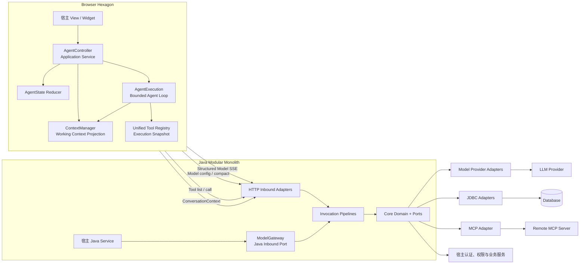
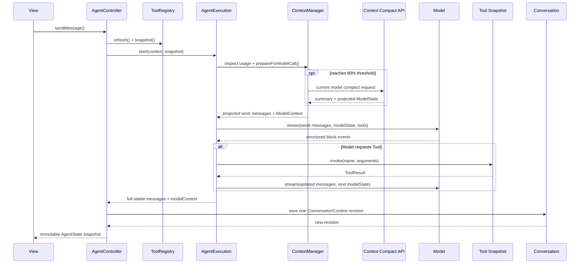

# 架构设计：模块化单体、六边形架构与设计模式

- 状态：当前实现的权威架构说明
- 适用范围：Browser Agent Runtime、Java Core、Spring Boot Starter、Model、Tool、MCP、Conversation、上下文压缩、Widget 与调试视图
- 核心目标：后端无 Agent Runtime 状态；对宿主前后端代码保持最小侵入

> 2026-09-05 实现核对：本文的不变量仍是架构约束。审查确认的后端动态 Tool 版本一致性、
> 首轮保存快照、取消后继续、Java Tool 异常分类和压缩后预算检查五项缺口已完成修复，2026-09-06 后续复审补齐组合边界
> 并补齐回归（VA-01～VA-05，实现与验证记录见[路线图](../roadmap.md)）；真实外部协议与
> 宿主环境仍需按后续里程碑验证。详见
> [愿景与实现审查](reviews/vision-and-implementation.md)。

## 设计结论

PatchBridge Agent 采用的总体架构是：

> Browser 运行 Agent，Server 运行安全边界与业务，LLM 负责推理。

代码组织采用**模块化单体**，模块内部采用**六边形架构（Ports and Adapters）**，Browser
交互状态采用**显式状态机**，Agent 执行采用**有界 Execution 模型**。

这四个选择解决的是不同问题：

| 选择 | 解决的问题 |
| --- | --- |
| Browser Agent Runtime | 避免后端为每个在线用户维护长期 Agent 实例 |
| 模块化单体 | 保持一次依赖、一次部署的低接入成本，同时约束模块边界 |
| 六边形架构 | 让模型、存储、权限、MCP、HTTP 传输和 UI 可以替换而不修改领域逻辑 |
| 显式状态机与 AgentExecution | 让异步竞态、取消、确认和有界循环成为可验证的业务语义 |

项目不采用微服务拆分，也不引入通用 Workflow、Graph、Plugin Container 或分布式
Checkpoint。当前需求可以由更小、更明确的接口完成，增加这些机制只会扩大部署和维护成本。

## 两个最高目标

### 后端无 Agent Runtime 状态

“无状态”不是不使用数据库，也不是请求处理期间不能持有对象。它指后端不持有跨请求的
Agent 执行状态：

- 不保存每个用户当前执行到 Agent Loop 的哪一步；
- 不在 JVM 内保留长期 Agent、线程、Checkpoint 或等待确认对象；
- 任意应用节点都能处理下一次 Model、Tool 或 Conversation 请求；
- 模型调用所需的工作消息和对应 `ModelState` 由 Browser 请求显式携带；
- Conversation 和 MCP 配置是持久化业务数据，不是驻留在节点内存中的 Agent Session。

取消后结果未知的核实约束由 Browser 从完整历史中的 `ToolResultBlock.execution` 重建。
它随消息持久化，压缩、恢复或会话切换不清除事实；服务端不保存等待确认的 Execution。
MCP 公开版本使用宿主注入的独立共享密钥计算 HMAC，多实例使用相同密钥，避免公开凭据摘要。
配置和升级约束见[配置参考](../reference/configuration.md)与[Runtime 契约](../reference/runtime-contracts.md)。

SSE 连接、`ModelCall` 取消句柄和一次 HTTP 请求的上下文属于短生命周期资源，请求结束后即
释放，不改变后端无 Agent Runtime 状态的定义。

### 对宿主系统最小侵入

框架只接管 AI 编排需要的通用能力，不接管企业自己的业务决策：

- 身份来自宿主 `CurrentUserProvider`；
- 会话归属由宿主 `ConversationOwnerResolver` 定义；
- Tool 权限由宿主 `ToolAccessPolicy` 定义并在每次调用时重新检查；
- Admin 权限由宿主 `AdminAccessPolicy` 定义；
- 企业可以整体替换 `ModelTargetCatalog`、`ModelAccessPolicy`、`ConversationRepository`、`AuditSink`、MCP 存储与加密；
- Browser 可以注入统一 `HttpTransport`，复用既有 Cookie、Bearer、CSRF 和刷新链；
- UI 可以使用可选 Widget，也可以只使用 Headless Agent 自行渲染。

因此，框架与业务的边界不是“框架什么都不管”，而是“框架定义稳定端口，宿主拥有业务策略”。

## 总体结构



依赖方向必须始终指向稳定契约：

```text
外部技术 / 宿主实现
        ↓ 实现 Port
Adapter → Application Service → Domain / Port
```

Core 不反向依赖 Spring、OkHttp、WebFlux、Jackson、JDBC、DOM 或某个模型厂商 SDK。

## 模块化单体

### 为什么不是微服务

框架的主要交付形式是被企业应用作为 Maven 依赖引入。Model Gateway、Tool Gateway、
Conversation 和 MCP Gateway 与宿主的认证、事务、业务 Service 位于同一个进程，能够直接
复用现有安全链和代码，不需要新增服务发现、内部鉴权、分布式追踪或跨服务事务。

“模块化”提供代码边界，“单体”保留低部署成本。模块可以独立测试和替换，但默认仍随宿主
应用一起部署。

### Java 模块职责

| 模块 | 业务定位 | 允许依赖 | 禁止承担 |
| --- | --- | --- | --- |
| `patchbridge-agent-annotations` | 零依赖 Tool 声明契约 | JDK 8 | Spring 扫描、Tool 调度 |
| `patchbridge-agent-core` | 领域模型、公共 Port、调用管线和业务不变量 | Annotations、JDK 8 | HTTP、数据库、厂商协议 |
| `patchbridge-agent-storage-jdbc` | Conversation、Audit、MCP 配置的 JDBC Adapter | Core、MCP、Spring JDBC、Jackson、SLF4J | Controller、权限策略 |
| `patchbridge-agent-mcp` | Global MCP 专用 Port、配置应用服务、远端 Client 与 Tool Provider Adapter | Core、HTTP/Jackson、SLF4J | Agent Loop、宿主登录体系 |
| `patchbridge-agent-model-openai` | OpenAI Chat 协议内核：厂商字段编码、SSE chunk 解码与 reasoning 状态的唯一实现 | Core、Jackson | HTTP 传输、取消、Spring 依赖 |
| `patchbridge-agent-model-webflux` | 可选非阻塞 ModelProvider Adapter | Core、OpenAI 协议内核、WebFlux | 自动装配、改变宿主 Web 类型、第二套协议实现 |
| `patchbridge-agent-spring-boot2-starter` | Composition Root、HTTP 入站 Adapter 与默认实现 | 上述模块、Spring Boot 2 | 定义企业角色、租户和业务规则 |
| `patchbridge-agent-demo` | 宿主应用示例和真实功能验收 | Starter | 被框架模块反向依赖 |

Starter 中的自动配置是**装配层**，不是领域层。默认 Bean 使用
`@ConditionalOnMissingBean` 让位于宿主实现，但默认实现与自定义实现必须遵守同一个 Core
契约，不能各自形成第二套业务语义。

### Browser 包职责

| 包 | 业务定位 |
| --- | --- |
| `@patchbridge-agent/agent` | Headless Controller、状态机、Agent Runtime、端口与默认 HTTP Adapter |
| `@patchbridge-agent/widget` | 可选参考 View；每个元素装配唯一 Controller，调用公共意图并订阅状态 |
| `@patchbridge-agent/webmcp-adapter` | 把 `document.modelContext` 转换为 Browser Tool Provider |
| `@patchbridge-agent/tool-inspector` | 只读调试 View；消费执行感知的 ToolInspectionSource |
| `@patchbridge-agent/call-trace` | 只读 Execution 账本 View；消费 CallTraceSource，不参与 Agent 调度 |

每个 Widget 实例只装配一个主 Controller；Inspector 和 Call Trace 只消费该 Controller
暴露的只读 Source，不能创建第二个 Controller、Tool Registry 或消息状态源。这些 View 是
Headless Agent 之上的 Adapter，可以随时替换或从生产构建中删除。

## 两个六边形

项目不是只有一个笼统的“Core”。Browser 和 Java Server 各自拥有独立六边形，二者通过
明确 HTTP 协议通信。

### Browser Hexagon

Browser 的领域核心是稳定消息、状态和执行语义：

- `AgentMessage + ContentBlock`；
- `ConversationContext { messages, modelContext }`；
- `ContextManager` 与上下文窗口投影；
- `AgentState` 与纯 reducer；
- `AgentExecution`、中断、取消和有界 Agent Loop；
- `ToolRegistrySnapshot`。

主要端口如下：

| Port | 方向 | 默认 Adapter |
| --- | --- | --- |
| `PatchBridgeAgentController` | View 调用的入站端口 | `DefaultAgentController` |
| `AgentEngine` | Controller 调用的执行端口 | `DefaultAgentRuntime` |
| `Model` | Runtime 的模型出站端口 | `HttpModel` |
| `ToolRegistry` | Tool 发现、冻结与调用端口 | `DefaultToolRegistry` |
| `ConversationClient` | 会话持久化出站端口 | `HttpConversationClient` |
| `ContextManager` | 工作上下文编排端口 | `DefaultContextManager` |
| `ContextCompactionGateway` | 模型配置与摘要出站端口 | `HttpContextCompactionGateway` |
| `HttpTransport` | 企业 HTTP 安全链端口 | `FetchHttpTransport` 或宿主实现 |
| `ToolInspectionSource` | 调试 View 的只读端口 | `ExecutionAwareToolInspectionSource` |

DOM、Fetch、SSE 切帧和 WebMCP 都位于 Adapter 侧。Runtime 不允许解析
`choices`、`tool_calls`、`reasoning_content` 或 `[DONE]` 等厂商字段。

### Java Server Hexagon

Java Core 定义跨模块领域对象与公共扩展端口，MCP 模块定义 MCP 专用 Port 和应用服务；
Starter Controller 是入站 Adapter，模型、JDBC、远程 MCP 和宿主安全体系是出站 Adapter。

关键 Port 按职责分组：

| 领域 | Port |
| --- | --- |
| Model 入站 | `ModelGateway`、`ModelInvocation` |
| Model 出站 | `ModelProvider`、`ModelCall`、`ModelStreamListener`、`ModelStateProjector` |
| Context Compaction | `ContextCompactionProvider`、`ContextCompactionInvocation` |
| Tool | `ToolProvider`、`ToolRegistry`、`ToolAccessPolicy`、`ToolNamingStrategy` |
| Conversation | `ConversationRepository`、`ConversationOwnerResolver` |
| Identity / Admin | `CurrentUserProvider`、`AdminAccessPolicy` |
| Audit | `AuditSink`、`AuditQueryRepository`、`AuditRedactor` |
| MCP（由 `patchbridge-agent-mcp` 定义） | `McpConfigurationStore`、`McpCredentialCipher`、`RemoteMcpClient` |
| Schema | `ToolSchemaGenerator` |

`properties` 与 `jdbc` 是 Starter 默认 MCP 配置源的互斥选项。宿主同时替换
`McpConfigurationStore`、凭据保护和相关运维责任时，可以使用自定义 source 标识；这属于
Port 替换，不是默认 JDBC 失败后切换到备用实现。

`ModelInvocationPipeline` 和 `ToolInvocationPipeline` 是应用服务，负责把 Core Port、可信请求
上下文、Interceptor 和唯一终止语义组合起来。HTTP Controller 不应绕过 Pipeline 直接调用
Provider 或 Registry。

`ModelGateway` 是宿主 Java Service 的同 JVM 入站 Port。默认实现把一次流式 Provider 调用
严格聚合为不可变 `ModelResponse`，并通过短生命周期 `ModelInvocation` 暴露异步结果、阻塞
等待、超时和取消。它仍然复用 `ModelInvocationPipeline`，不建立第二套 Provider 协议；也不
读取 Web 登录态或隐式访问 Conversation、Audit 和持久化。需要用户、租户或链路信息时，宿主
必须传入可信 `AiRequestContext`，是否保存返回结果仍由宿主业务事务决定。

## 核心领域模型

### Message + ContentBlock

稳定消息使用有序内容块表达文本、图片、展示思考、Tool Call 和 Tool Result。它解决了把
所有内容压成字符串后由各层重复猜测格式的问题。

Tool 参数只有完成 JSON 聚合和对象校验后才能进入稳定 `ToolCallBlock`。流式字符串片段只
能存在于 Model Message Assembler 内部，不能进入 View、持久化或 Tool 调度。

### ModelState

`ReasoningBlock` 是允许展示的内容；签名、加密 reasoning item、continuation token 等
续接状态属于 `ModelState { format, data }`。

Runtime 和 Conversation 只负责原样传递与保存。Provider 负责校验 `format` 并解释
`data`。这样增加 Anthropic 或 Responses API Adapter 时，不需要修改 Browser 状态机和
Conversation 公共协议。

Provider 还独占 ModelState 的生命周期决策。每个 `message-stop` 都返回完整的下一
状态：非空值完整替换旧值，`null` 明确清空旧值。Runtime 不合并新旧状态，
也不根据 Tool Call、停止原因或 `data` 推测何时清理。因此新厂商只需在自己的
Provider 内实现状态裁剪与失效规则。

### ConversationContext 聚合

`ConversationContext` 是持久化聚合根，包含完整历史和独立模型工作上下文：

```text
ConversationContext
├── messages: ordered AgentMessage[]
└── modelContext
    ├── checkpoint: ContextCompactionCheckpoint | null
    ├── firstRetainedMessageId: String | null
    ├── modelState: ModelState | null
    └── usage: ModelContextUsage | null
```

`messages` 始终保存完整、可展示历史；压缩只更新 `modelContext`，下一次模型调用使用 system、
摘要检查点和近期真实消息的投影。二者必须使用同一个 revision、同一个事务保存和读取。
Repository 不提供分别保存消息与工作上下文的方法，避免产生新版消息搭配旧版模型状态的撕裂快照。

显式会话连续状态重置属于 [ADR-002](adr/0002-model-state-lifecycle.md) 已接受、尚待实施的
操作，当前没有对应的重置入口。计划契约要求 Repository 在 owner 范围和
`expectedRevision` 下原子保留消息、将 `modelContext.modelState` 设为 `null`、推进 revision
并返回完整快照；即使状态原本已空也推进 revision，使迟到 Execution 或其他 Tab 的旧保存
明确冲突。该操作不选择 Provider。当前按会话路由与显式 handoff 见 Accepted
[ADR-005](adr/0005-model-target-routing-and-switching.md)，实施状态均以[路线图](../roadmap.md)为准。

上下文压缩不属于显式状态重置。`DefaultContextManager` 负责 80% 阈值、安全消息段、重复
摘要和模型输入投影；Server 用当前模型生成摘要，并通过当前 Provider 的
`ModelStateProjector` 生成只与新工作上下文一致的状态。Browser 不读取或通用地清空
Provider 私有数据。完整决策见[ADR-004](adr/0004-context-compaction.md)。

### Tool Registry Snapshot

一轮执行开始前，Controller 刷新并冻结唯一 `ToolRegistrySnapshot`：

- 模型看到的 Tool 定义来自该快照；
- Tool Call 只能由该快照路由；
- Inspector 在执行期间展示同一个 revision；
- 执行中发生的注册、注销和远端刷新只影响下一轮。

这是能力列表和实际执行器一致性的核心不变量。

## 显式状态机与执行模型

### AgentState reducer

`DefaultAgentController` 是 Browser Application Service，负责协调异步端口；所有 UI 状态
变化都必须转换为具名 `AgentStateEvent` 并交给纯函数 reducer。Controller 不允许直接做
任意 `Partial<AgentState>` patch。

该设计带来三个约束：

1. 每次状态变化都有明确业务含义；
2. 状态转换可以脱离 DOM 和网络单独测试；
3. 新增状态必须同时考虑所有事件，不会散落在多个组件中。

Navigation 与 Agent Run 分属两个异步域。`AbortController` 负责停止工作，generation
令牌负责阻止无法取消或迟到的结果提交。保存阶段也受 run generation 约束。

### AgentExecution

每次 `AgentEngine.start()` 返回独立 `AgentExecution`。Execution 独占：

- `AbortSignal`；
- Human-in-the-loop 中断槽；
- 本轮 Tool Snapshot；
- 最终结果 Promise；
- 模型次数、Tool 次数、整轮 Deadline、模型聚合字符和 Tool 结果字符五项预算；
- `completed | max-tokens | cancelled` 互斥 Outcome 与唯一终态门。

Engine 不保存一个可被并发请求覆盖的隐式“当前 run”。直接构造 Runtime 必须提供完整五项
`limits`；工厂和 Widget 只在 `runtime.limits` 中接受部分覆盖，统一默认值为
`16 / 32 / 300000 / 100000 / 100000`。取消与 Deadline 先关闭逻辑终态门，再向 Model、Tool 和
等待中的确认传递协作取消；不合作的异步任务不能阻止结果收敛，也不能迟到发布事件。
不完整的 ContentBlock 不能进入稳定消息。

### 一轮执行时序



## 使用的设计模式

模式只用于表达已经存在的稳定职责，不为了“模式数量”增加抽象。

| 模式 | 当前落点 | 设计目的 |
| --- | --- | --- |
| Ports and Adapters | Core Port + HTTP/JDBC/Model/MCP/UI Adapter | 依赖倒转，隔离框架与厂商技术 |
| Application Service | `DefaultAgentController`、Invocation Pipeline、`McpConfigurationManager` | 收敛用例编排，不把流程散落进 View/Controller |
| Strategy | ModelProvider、权限、归属、命名、Schema、加密、HTTP Transport | 宿主替换一个决策而不 Fork 主流程 |
| Adapter | OpenAI Chat、WebFlux、JDBC、Spring Security、WebMCP、Widget | 把外部协议转换为 Core 契约 |
| Registry + Composite | Java `ToolRegistry`、Browser `DefaultToolRegistry` | 聚合多种 Tool 来源并提供单一命名空间 |
| Snapshot | `ToolRegistrySnapshot`、不可变 AgentState、ConversationSnapshot | 固定一次执行或一次读取所依赖的一致数据 |
| State / Reducer | `AgentStateEvent` + `reduceAgentState` | 显式描述 UI 与执行状态转换 |
| Chain of Responsibility | Model / Tool Interceptor Pipeline | 按确定顺序执行审计、策略和调用治理 |
| Observer | Agent Hook、Controller subscribe、ToolInspectionSource | 只读观察，不获得主流程控制权 |
| Repository | Conversation、Audit、MCP Configuration Store | 隔离领域聚合与持久化技术 |
| Factory / Composition Root | `createAgentController`、Spring AutoConfiguration | 集中装配默认实现并校验互斥配置 |
| Facade | `PatchBridgeAgentController`、`ModelGateway`、`<patchbridge-agent>` | 给普通用户提供小而稳定的接入表面 |

### 为什么 Hook 与 Interceptor 分开

Hook 只能观察稳定生命周期事实，不能调用 `next`，也不接触 ModelState 或 Runtime 私有状态。
Interceptor 才能包围一次 Model 或 Tool 调用，并且 `next` 每次只能调用一次。

普通 Hook 违约仍使 Execution 明确失败；终态一旦选定，终态 Hook 失败只能通过独立
`onHookError` diagnostics 观察，不能广播第二个终态。这样 Call Trace、宿主审计与
`AgentExecution.result` 不会因观察者注册顺序而产生相互矛盾的事实。

工厂开启 Call Trace 时，框架内部采集 Hook 固定排在宿主 Hook 之前。该顺序只保证先建立
只读执行账本：即使宿主在 `execution-started` 阶段失败，同一条 `execution-failed` 仍能
封闭轨迹并保留原始错误；宿主 Hook 之间的相对顺序不变。

二者分开可以防止一个“万能 Plugin Context”同时修改状态、DOM、模型和 Tool，最终形成无法
推断顺序的隐式控制流。

### 为什么 Registry 必须返回 Snapshot

Registry 是动态能力目录，Execution 是稳定执行单元。如果 Runtime 每次 Tool 调用都重新查
动态 Registry，模型看到的定义可能已经被替换或删除。Snapshot 把动态发现和稳定执行分开，
既支持页面 Tool / WebMCP 热更新，也保证本轮行为可解释。

## 模型目标与会话路由

默认 Starter 从 `patchbridge-agent.models` 创建不可变目录；`ModelTargetRef { targetId, routingRevision }` 是 Browser、压缩、Java Gateway 和持久化 Context 共有的路由身份。Router 统一检查目标存在、启用、修订和授权，再交给目标绑定的协议 Adapter。目标不可用时明确失败，不沿用默认目标。完整历史、当前目标和模型工作上下文在同一会话 revision 下原子保存；显式 handoff 保留历史、清除旧私有状态并为新窗口重估，普通保存不能更改目标。模型目录只经部署配置或宿主完整替换 Catalog 管理，当前没有在线模型后台。决策见[ADR-005](adr/0005-model-target-routing-and-switching.md)。

## Provider 协议边界

Browser 与 Java Core 只使用结构化事件：

- `block-start`；
- `block-delta`；
- `block-stop`；
- `message-stop`；
- 流内标准 `error`。

OpenAI Chat 的 `choices`、`tool_calls`、`reasoning_content` 和 `[DONE]` 只能存在于对应
Provider Adapter；Anthropic Messages 的具名 SSE、`thinking` 签名与工具别名也只在其协议内核和私有 `ModelState` 中。Provider 负责：

1. 编码目标厂商请求；
2. 剥离框架消息 ID；
3. 恢复并校验自己的 ModelState；
4. 把厂商增量转换成结构事件；
5. 产生下一份 ModelState；
6. 把网络和协议错误转换成框架错误；
7. 提供幂等取消句柄。

当前 OpenAI Chat 与 Anthropic Messages 通过同一 `ModelProviderRouter` 绑定各自 Adapter。若增加新的模型协议，新增 Adapter 和独立 `ModelState.format`，不在 Runtime 内增加厂商条件分支。

Provider 契约使用仓库级
[`model-provider-contract-v1.json`](../../test-fixtures/model-provider-contract-v1.json) 共享可跨语言表达的标准结构事件序列。
Java 协议内核与 Browser `HttpModel` 在各自测试框架中读取它；编码、`ModelState`、取消和传输生命周期
仍属于各 Adapter 的独立契约测试。fixture 只是测试数据，不形成生产依赖或跨语言测试基类。

## 安全与租户边界

Browser 传来的 userId、tenantId、权限和 Tool 风险标记都不能作为服务端可信事实。

服务端链路必须遵守：

```text
宿主认证态
  → CurrentUserProvider
  → UserContext
  → ConversationOwnerResolver / ToolAccessPolicy / AdminAccessPolicy
  → Repository 或业务 Service
```

Tool 列表过滤不能替代 Tool 调用鉴权；每次 `call` 都要重新执行 `canInvoke`。Repository 的
每条会话 SQL 都携带 ownerKey。MCP 管理权限属于服务端出站和 SSRF 高权限边界，不能等同于
普通 Tool 使用权限。

## Global MCP 架构

第一版 Global MCP 只允许一个明确配置源：`properties` 或 `jdbc`。两者互斥，不合并，也不
在失败时切换来源。

JDBC 模式由 `McpConfigurationManager` 收敛配置 CRUD、revision 与凭据更新语义；
`McpConfigurationStore` 负责持久化；`McpCredentialCipher` 负责密文；
`McpToolRegistry` 以不可变路由快照向统一 Tool Registry 发布能力。

Global MCP 是 Tool Adapter，不是第二套 Agent Runtime。远端 MCP Server 只提供 Tool，
Browser Agent Loop 仍是唯一编排者。

## 扩展一个功能时放在哪里

| 需求 | 正确扩展点 | 不应该修改 |
| --- | --- | --- |
| 接入新模型协议 | 新 `ModelProtocolAdapterFactory` 与协议内核、状态格式 | Agent Runtime、Controller、View |
| 自定义压缩状态投影 | Provider 的 `ModelStateProjector` / `ContextCompactionProvider` | Browser 按 format 读取或清空私有状态 |
| Java Service 单次调用模型 | 注入 `ModelGateway`，按需显式传入 `AiRequestContext` | 反向请求 Browser SSE、在框架内增加业务 Repository |
| 复用企业 HTTP 安全链 | `HttpTransport` | 三个 Http Client 各写一套鉴权 |
| 自定义租户归属 | `ConversationOwnerResolver` | Controller 请求参数、JDBC 内猜 tenant |
| 自定义 Tool 权限 | `ToolAccessPolicy` | 注解扫描器或 Registry 写死角色 |
| 替换会话存储 | `ConversationRepository` | Conversation Controller |
| 增加 Tool 来源 | `ToolProvider` / Browser Tool Provider | Agent Loop 按来源分支 |
| 增加审计策略 | Audit Port / Interceptor / Hook | Provider 或业务 Tool 内重复记录 |
| 自定义 UI | Headless Controller 或 Widget token/part | Runtime 内访问 DOM |
| 增加调试视图 | 只读 Source / Hook | 创建第二份 Runtime 状态 |

判断顺序是：

1. 这是领域协议或业务不变量吗？放 Core。
2. 这是一个用例编排吗？放 Application Service。
3. 这是外部技术转换吗？实现 Adapter。
4. 这是企业自己的策略吗？提供窄 Port，由宿主实现。
5. 只是为了少写几行代码吗？不要因此扩大公共接口。

## 当前契约策略：只有一个实现

项目尚未公开发布，当前代码和 Schema 是唯一契约：

- 不提供旧 DTO 解析；
- 不提供旧字段别名；
- 不提供数据库双写或自动迁移；
- 不保留 deprecated API；
- 不在新实现失败时调用另一套实现；
- 不让 properties 与 JDBC 配置源互相 fallback；
- 不通过“字段缺失时填默认值”掩盖客户端与服务端版本错配。

协议输入采用精确字段校验。对错误形状返回明确错误属于当前契约的校验，不属于兼容逻辑。

在首次公开发布之前，领域契约变化应一次性替换 TypeScript、Java Core、HTTP DTO、数据库
Schema、Widget、Demo、测试和文档。Git 历史负责保存演进过程，生产代码不保存历史实现。
首次公开发布后的兼容策略必须单独决策，不能因为未来可能需要就提前在当前代码中增加分支。

## 架构不变量

代码评审必须持续检查以下不变量：

1. Agent Loop 只在 Browser Runtime 中运行。
2. 后端不持有跨请求的 Agent Execution 状态。
3. Browser Runtime 和 Java Core 不出现厂商 wire protocol 字段。
4. 完整 Message 与 ModelContext 分离，但作为一个 ConversationContext 原子持久化。
5. AgentState 只能通过具名事件和 reducer 修改。
6. Model 定义和 Tool 调度使用同一个 ToolRegistrySnapshot。
7. 当前登录身份只来自服务端可信 Adapter。
8. Tool 发现过滤不替代每次调用鉴权。
9. 默认 Starter Bean 可以被宿主 Port 实现替换，且不会污染宿主全局异常或安全配置。
10. Widget、Inspector 和其他调试 View 不拥有第二份领域状态。
11. 取消后不提交迟到事件、稳定消息或保存结果。
12. 不增加未经需求验证的兼容、fallback、降级或万能插件机制。
13. Java `ModelGateway` 默认只发起一次 Provider 调用，不执行 Tool、Agent Loop 或隐式持久化。
14. 模型声明的一批 Tool Call 必须在当前批任何 Tool 执行前完成停止原因、ID、路由、参数和次数预检。
15. `ToolCallResult.isError` 是模型可见业务失败；Tool/Adapter/Interceptor throw 或 rejection 必须终止 Execution。
16. Tool 结果超限或运行中 Deadline 不承诺回滚宿主副作用，但必须阻止结果发布与下一次模型调用，并隔离迟到完成/异常。
17. 上下文压缩不得删除完整消息；自动与手动路径共享 ContextManager、当前模型和 Provider 状态投影。
18. 正常模型响应必须提供 token usage；压缩失败保持旧 ModelContext 且不继续发送可能溢出的请求。
19. Browser Tool 结果必须在 Runtime 边界校验精确字段、类型与调用 ID；只有严格的 `isError === true` 才能作为模型可见业务失败继续循环。

相关专项决策见：

- [ADR-001：厂商中立 Agent Runtime 核心契约](adr/0001-provider-neutral-runtime.md)
- [文档中心](../README.md)
- [思考模型 reasoning_content 回传规则调研报告](../research/reasoning-content.md)
- [`@patchbridge-agent/agent` 使用文档](../../web/packages/agent/README.md)

---

## 架构与责任矩阵

### 一句话架构

> Browser 运行 Agent，Server 运行安全边界与业务，LLM 负责推理。

Browser 持有 Agent Loop、当前 Execution、流式临时状态和 Human-in-the-loop 等待；Server 不保存跨请求的 Agent 执行步骤、长期 Agent 实例或等待确认对象。Conversation、Audit 和 MCP 配置是持久化业务数据，不是驻留 JVM 的 Agent Runtime。

### 不变量

1. <code>DefaultAgentController</code> 是 Browser Application Service，也是 <code>AgentState</code> 的唯一所有者；View 不维护第二份消息、确认或流式状态。
2. 一次 <code>AgentEngine.start()</code> 返回独立 <code>AgentExecution</code>；取消、确认、五项资源预算、Deadline 和唯一终态都属于该 Execution。
3. 一轮运行只使用一个不可变 <code>ToolRegistrySnapshot</code>；模型定义、实际调用路由和 Inspector 展示使用同一 revision。
4. 稳定消息由 <code>AgentMessage + ContentBlock</code> 表示；当前 Block 为 text、image、reasoning、tool-call、tool-result。
5. 流式 Tool 参数只有在完整聚合并验证为 JSON 对象后，才能进入稳定消息或实际调用。
6. 展示 reasoning 与 <code>ModelState { format, data }</code> 分离；Runtime、Controller 和 View 不解释 <code>data</code>。
7. <code>ConversationContext</code> 同时包含完整 messages 和 modelContext，二者使用同一 revision、同一事务保存；压缩只改变后者。
8. Browser 传入的 userId、tenantId、roles、permissions 或风险结论不是服务端可信事实。
9. 当前只有一个公开契约；未知字段、旧字段和非法形状明确失败，不存在 alias、fallback 或双轨协议。

### 责任矩阵

| 责任 | 框架 | 宿主应用 | 基础设施 |
| --- | --- | --- | --- |
| Agent Loop 和状态机 | Browser Runtime | 选择 Widget 或自定义 View | 浏览器生命周期 |
| 模型目录与协议适配 | YAML 唯一部署目录、统一 Router、OpenAI Chat 与 Anthropic Messages Adapter | 可整体替换 <code>ModelTargetCatalog</code> / <code>ModelAccessPolicy</code> | 模型 endpoint、凭据、配额和可用性 |
| 身份 | <code>CurrentUserProvider</code> Port | 从现有认证系统解析可信用户 | SSO、Session、JWT 生命周期 |
| Tool 权限 | 每次调用执行 <code>canInvoke</code> | 定义 RBAC/ABAC 语义和业务 ACL | 网关/WAF/Rate Limit |
| 会话归属 | owner 等值隔离 | 多租户 owner key 规则 | 数据库备份和访问控制 |
| Admin | 能力枚举和拦截器 | <code>AdminAccessPolicy</code> | 管理网络暴露面 |
| MCP 凭据 | 服务端配置、加密、不回显 | 密钥轮换和权限审批 | KMS/Vault、出站代理和防火墙 |
| CSRF/CORS | 不修改宿主全局安全配置 | 复用现有安全链 | 反向代理和域名策略 |
| 审计 | 事件、Sink、Redactor | 合规保留、脱敏和失败策略 | 日志与数据库可靠性 |

### Java 模块

| 模块 | 角色 |
| --- | --- |
| <code>patchbridge-agent-annotations</code> | 零 Spring 依赖的 <code>@AiTool</code>/<code>@AiParam</code> |
| <code>patchbridge-agent-core</code> | 领域模型、Port、调用管线和不变量 |
| <code>patchbridge-agent-model-openai</code> | OpenAI Chat 协议内核，OkHttp / WebFlux Adapter 共用 |
| <code>patchbridge-agent-model-anthropic</code> | Anthropic Messages 协议内核与私有思考状态 |
| <code>patchbridge-agent-model-webflux</code> | 可选 WebFlux <code>ModelProvider</code> Adapter，不自动装配 |
| <code>patchbridge-agent-storage-jdbc</code> | Conversation、Audit、MCP JDBC Adapter 和 H2/MySQL schema |
| <code>patchbridge-agent-mcp</code> | Global MCP 配置应用服务、Streamable HTTP Client 和 Tool Provider |
| <code>patchbridge-agent-spring-boot2-starter</code> | Boot 2 Composition Root、HTTP Adapter、默认 Bean 和静态资源 |
| <code>patchbridge-agent-demo</code> | 真实接入示例，不是框架运行时依赖 |

父坐标是 <code>io.patchbridge.agent:patchbridge-agent-parent:0.1.0-SNAPSHOT</code>。

### Browser workspace

| Workspace | 当前用途 | R0 外部分发边界 |
| --- | --- | --- |
| <code>@patchbridge-agent/agent</code> | Headless Controller、Runtime、ContextManager、Client、Registry | 源码 workspace；未发布 npm |
| <code>@patchbridge-agent/widget</code> | 参考 Web Component | 通过 Starter IIFE 使用 |
| <code>@patchbridge-agent/webmcp-adapter</code> | 可选 WebMCP Adapter | ESM 源码或 Starter IIFE；未发布 npm |
| <code>@patchbridge-agent/tool-inspector</code> | 只读 Tool 快照视图 | 通过 Starter IIFE 使用 |
| <code>@patchbridge-agent/call-trace</code> | Browser Execution 调用轨迹视图 | 通过 Starter IIFE 使用 |

Widget、Inspector 和 Call Trace workspace 的 npm 元数据尚不是已冻结的公共 npm 发布契约。R0 使用者应以 Starter 内置 IIFE 为静态页面入口；不要把 <code>npm install @patchbridge-agent/...</code> 写入生产构建脚本。

---

## Unified Tool Registry 设计原因

Tool Source 契约预留五种来源；v0.1 当前接入其中四种：

- `LOCAL`：后端 Java `@AiTool`；
- `MCP`：后端代理的远程 MCP Server；
- `FRONTEND_LOCAL`：当前页面直接注册的 JavaScript Tool；
- `WEBMCP`：浏览器 `document.modelContext` 暴露的 Tool。

`OPENAPI` 只保留在来源枚举中供后续 Existing API / OpenAPI Adapter 使用；该 Adapter 尚未实现，不属于 v0.1 可用能力。

如果聊天 Runtime、调试列表和每种 Adapter 分别维护列表，会出现最危险的一类错配：模型看到了一个定义，真正执行时却路由到了另一个版本。现在所有来源先进入一个 `ToolRegistry`：

```text
Backend / Frontend Local / WebMCP Provider
                    ↓
          Unified Tool Registry
                    ↓
       immutable run snapshot → Agent Runtime
                    ↓
        execution-aware inspection source
                    ↓
          read-only Inspector
```

Controller 在每轮发送消息前刷新 Registry，并把同一 revision 的 `tools` 和 `invoke()` 快照一起交给 Runtime。注册、注销或远程刷新只生成新快照，不会改变已经开始的一轮调用。不同来源重名时直接报错，不按来源优先级静默覆盖。

这也是“Tools 调试”能与 Agent 实际能力一致的原因：Inspector 不直接追随不断变化的
Registry。Controller 在执行中把它固定到 Runtime 实际持有的 `current-execution`
revision，执行结束后才切回 `current-registry`。因此运行中新增一个页面 Tool 时，列表
不会错误地暗示本轮模型已经可以调用它。
