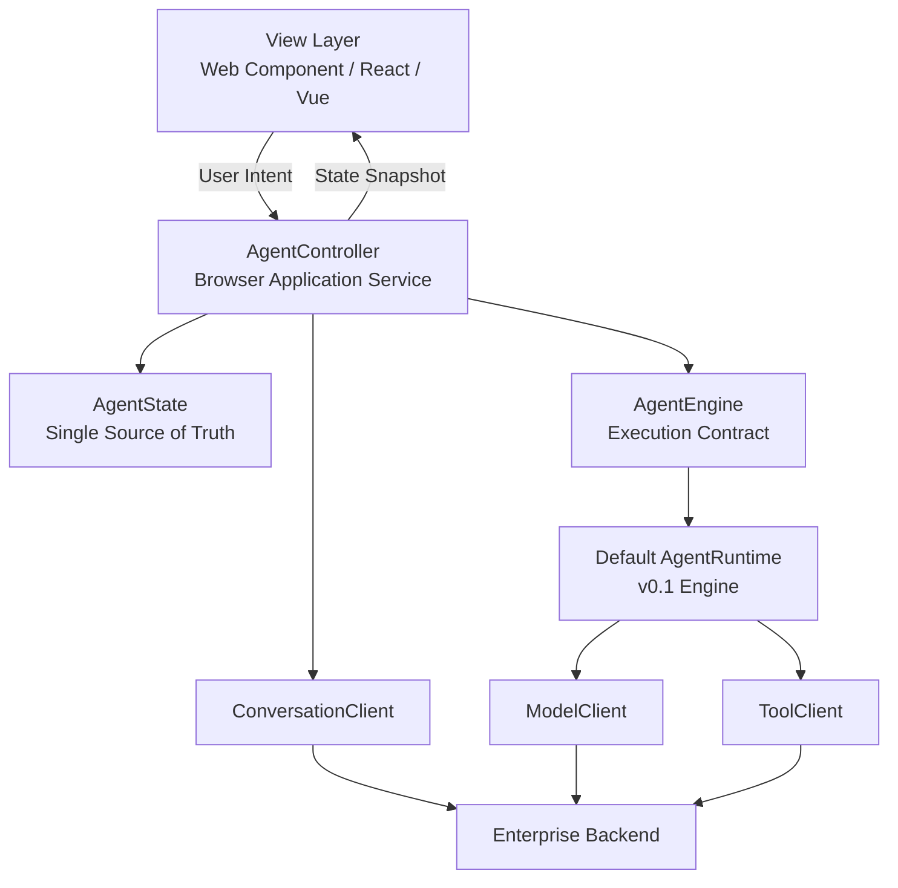

# 前端架构设计：AgentController + 单一状态源（v0.1）

> **文档定位**：本文保存 Browser 架构形成过程与设计原则，不是当前公共 API 手册。
> Single Source of Truth、Latest Request Wins、Controller 边界等不变量仍然有效；接口草案、
> Strands 示例和未来 Engine 设想可能已被当前实现替代。实际接入以[《文档中心》](../README.md)
> 与源码为准，当前权威架构以[《架构设计：模块化单体、六边形架构与设计模式》](../architecture/overview.md)为准。

<aside>
🎯

**设计目标**：Browser 侧采用清晰、稳定、可替换的分层架构。UI 只负责渲染与收集用户意图；`AgentController` 作为 Browser 层唯一 Application Service，统一管理状态、生命周期、异步竞态、会话导航和 Tool Confirmation；底层 `AgentEngine / AgentRuntime` 只负责 Agent 执行。

核心约束：**Single Source of Truth、DOM Is Not State、Latest Request Wins、Runtime Hidden Behind Controller、Engine Replaceable。**

</aside>

## 1. 设计背景与目标

Browser Agent 不是一个普通聊天组件。它同时涉及模型流式输出、Tool Call、Tool Result、Human-in-the-loop、Conversation 切换、跨设备恢复、页面生命周期和异步取消。如果这些职责直接堆进 Widget 或 Runtime，一个模块就会同时承担 UI、状态机、网络请求和 Agent 执行，最终形成强耦合。

因此前端设计必须从一开始定义稳定边界，而不是依赖事件顺序和 DOM 临时状态维持正确性。

本设计解决四个核心问题：

- **状态唯一性**：同一份业务状态只能有一个 Source of Truth。
- **依赖方向稳定**：UI 永远不依赖具体 Runtime 实现。
- **异步结果可控**：旧请求不能覆盖新状态。
- **执行引擎可替换**：后续接入 Strands 或其他 Agent SDK 时，Widget 和 Controller 契约不发生破坏性变化。

本设计不规定视觉框架。Web Component、React、Vue 或宿主系统自己的 UI 都可以接入同一个 Controller 契约。

---

## 2. 总体架构



依赖方向固定为：

```
View
  ↓
AgentController
  ↓
AgentEngine / ConversationClient
  ↓
ModelClient / ToolClient / Backend
```

禁止出现以下依赖：

```
View → AgentRuntime
View → ModelClient
View → ToolClient
View → ConversationClient
View → localStorage 作为业务状态源
AgentRuntime → DOM
AgentRuntime → Widget
```

这条依赖规则是 Browser 架构最重要的长期约束。

---

## 3. View Layer：只负责展示和用户意图

View 可以是当前的 Web Component，也可以由宿主应用换成 React / Vue。

它只负责：

- 创建和更新 DOM / Virtual DOM
- 输入框、按钮、滚动、折叠等纯 UI 交互
- 将用户行为转换成 Controller 调用
- 订阅 `AgentState`
- 根据 State 渲染

View 不负责：

- Agent Loop
- 模型请求
- Tool 请求
- Conversation 加载逻辑
- Streaming 文本业务拼接规则
- Tool Confirmation Promise 生命周期
- 判断异步请求是否过期
- 持久化
- 读取 Runtime 内部字段

典型接入方式：

```tsx
const unsubscribe = controller.subscribe((state) => {
  render(state);
});

await controller.sendMessage(text);
await controller.loadConversation(conversationId);
controller.startNewConversation();
controller.approveTool();
```

### 3.1 DOM 不是状态

禁止使用 DOM 节点保存业务语义，例如：

```tsx
streamingEl
currentAssistantNode
pendingToolElement
```

DOM 节点只能是 State 的渲染结果。

如果 DOM 被销毁并重新创建，只要 `AgentState` 还在，界面必须能够完整恢复。

---

## 4. AgentController：Browser 层唯一 Application Service

`AgentController` 是 UI 唯一允许依赖的业务入口。

它承担：

- AgentState 所有权
- 初始化
- Conversation 列表加载
- Conversation 切换
- 新建 Conversation
- 发送消息
- Abort
- Tool Confirmation
- Runtime Event → State 转换
- 异步取消
- stale result 丢弃
- 生命周期 dispose
- 对 View 发布状态

它不承担：

- DOM 操作
- OpenAI SSE 协议解析
- MCP 协议解析
- Tool HTTP 细节
- 后端业务权限

### 4.1 Controller 公共契约

```tsx
export interface PatchBridgeAgentController {
  getState(): AgentState;

  subscribe(
    listener: (state: AgentState) => void
  ): () => void;

  initialize(
    preferredConversationId?: string | null
  ): Promise<void>;

  refreshConversations(): Promise<void>;

  loadConversation(id: string): Promise<void>;

  startNewConversation(): void;

  sendMessage(text: string): Promise<void>;

  approveTool(): void;
  rejectTool(): void;

  abort(): void;
  dispose(): void;
}
```

### 4.2 `subscribe()` 语义

`subscribe()` 注册成功后必须立即推送一次当前状态。这样任何 UI 框架都只需要订阅，不需要额外执行一次初始化读取。

### 4.3 `getState()` 返回快照

不能把 Controller 内部可变引用直接交给 UI。

至少保证：

```tsx
return {
  ...state,
  conversations: [...state.conversations],
  messages: [...state.messages]
};
```

业务层应把 State 视为不可变快照。

---

## 5. AgentState：Browser 唯一状态源

建议定义：

```tsx
export type AgentStatus =
  | 'idle'
  | 'loading-conversations'
  | 'loading-conversation'
  | 'loading-tools'
  | 'streaming'
  | 'waiting-confirmation'
  | 'calling-tool'
  | 'saving'
  | 'done'
  | 'error';

export interface AgentState {
  status: AgentStatus;

  conversation: Conversation | null;
  conversations: readonly Conversation[];

  messages: readonly ChatMessage[];

  streamingAssistant: {
    content: string;
    reasoning: string;
  } | null;

  pendingConfirmation: {
    tool: ToolDefinition;
    arguments: Record<string, unknown>;
  } | null;

  error: AgentError | null;
}
```

### 5.1 稳定消息与 Streaming 消息分离

`messages` 表示已经提交的稳定消息。

`streamingAssistant` 表示当前正在生成、尚未提交的 assistant message。

收到模型 delta：

```
streamingAssistant.content += delta
```

收到 reasoning delta：

```
streamingAssistant.reasoning += delta
```

本轮执行完成后：

```
Runtime 产生稳定 message snapshot
↓
Controller 更新 messages
↓
streamingAssistant = null
```

这样不会再依赖某个临时 DOM 节点记录“当前生成到哪里”。

### 5.2 State 中禁止放基础设施对象

以下对象不允许进入 AgentState：

```
HTMLElement / Node
AbortController
Promise Resolver
Fetch Response
ReadableStream
Runtime Instance
```

AgentState 应尽量保持纯数据、可测试、可快照。

---

## 6. AgentEngine：执行引擎契约

Controller 不应该知道底层 Agent Loop 是自研、Strands、Pi 还是其他 SDK。

建议增加：

```tsx
export interface AgentEngine {
  run(input: AgentRunInput): Promise<AgentRunResult>;
  abort(): void;
  dispose(): void;
  subscribe(listener: (event: AgentEngineEvent) => void): () => void;
}
```

v0.1 可以用当前 `AgentRuntime` 作为默认 Engine 实现：

```
AgentController
      ↓
AgentEngine
      ↓
DefaultAgentRuntime
```

未来：

```
AgentController
      ↓
AgentEngine
      ├── DefaultAgentRuntime
      ├── StrandsAgentEngine
      └── CustomAgentEngine
```

UI、Conversation、权限协议和后端 API 不应因替换 Engine 而变化。

这体现项目的核心原则：

> **Core defines contracts. Starter provides defaults. Applications keep control.**
> 

---

## 7. Runtime / Engine 的职责边界

Engine 只负责一次 Agent Execution：

- Agent Loop
- Model Streaming
- Tool Calling Loop
- Tool Result 注入模型上下文
- 当前 run 的 Abort
- 产生 Engine Event

Engine 不负责：

- 当前 UI 选中了哪个 Conversation
- Widget 生命周期
- localStorage
- 页面导航
- DOM
- 登录跳转
- 历史 Conversation 列表
- 长期 Conversation Source of Truth

Engine 运行结束后，不应要求后端保存一个“仍在运行的 Agent 实例”。

---

## 8. Engine → Controller 事件模型

建议事件契约：

```tsx
export type AgentEngineEvent =
  | { type: 'status'; status: AgentStatus }
  | { type: 'messages'; messages: readonly ChatMessage[] }
  | { type: 'conversation'; conversation: Conversation | null }
  | { type: 'delta'; text: string }
  | { type: 'reasoning'; text: string }
  | { type: 'tool-call'; toolCall: ToolCall }
  | { type: 'tool-result'; result: ToolResult }
  | { type: 'error'; error: Error };
```

其中最重要的是 `messages` snapshot。

每次稳定消息发生变化时，Engine 应发布完整稳定消息快照；Controller 不需要访问 Engine 内部数组，更不需要 UI 自己推断消息状态。

---

## 9. 状态转换模型

所有状态转换由 Controller 统一完成。

### 9.1 初始化

```
idle
↓ initialize
loading-conversations
↓
加载当前用户 Conversation 列表
↓
存在待恢复 Conversation
    ↓
loading-conversation
    ↓
done

无 Conversation
    ↓
idle
```

### 9.2 发送消息

```
idle / done
↓ sendMessage
loading-tools / streaming
↓
模型输出
↓
可能 Tool Call
↓
calling-tool
↓
可能等待确认
↓
waiting-confirmation
↓
继续 calling-tool / streaming
↓
saving
↓
done
```

### 9.3 错误状态

任何业务流程异常统一进入：

```
error
```

同时：

- `state.error` 保存标准化错误
- pending confirmation 被清理
- 已经完成的稳定 messages 保留
- 临时 streaming 状态按错误策略结束

View 不解析网络异常类型，只展示 Controller 已标准化的错误。

---

## 10. 异步并发模型：Latest Request Wins

Conversation 切换、初始化、endpoint 变化都属于 Navigation Operation。

必须保证旧请求返回时不能覆盖新状态。

Controller 维护：

```tsx
private navigationGeneration = 0;
private navigationAbort: AbortController | null = null;
```

每开始一个新的 navigation：

```
abort previous request
↓
generation++
↓
发起新请求
↓
返回时检查 generation
↓
只有最新 generation 可以 commit state
```

示例：

```
load A  generation=10
load B  generation=11

B 返回 → generation=11 → commit
A 返回 → generation=10 → discard
```

### 10.1 为什么 AbortController 和 Generation 都需要

仅 AbortController 不够，因为底层 Provider 或 Promise 链不一定真正停止。

Generation Token 是最终一致性的第二道保护。

规则：

> **Abort 用于停止工作，Generation 用于阻止旧结果提交。**
> 

---

## 11. Agent Execution 与 Navigation 的并发关系

Conversation Navigation 和 Agent Run 不允许同时改变同一个会话状态。

建议规则：

- `sendMessage()` 开始前取消未完成的 navigation
- `loadConversation()` 开始前 abort 当前 run
- `startNewConversation()` 前 abort 当前 run 和 navigation
- endpoint / auth context 改变时 dispose 整个 Controller

这样可以避免“当前 run 还在把结果写到旧 Conversation，但 UI 已经切换到另一个 Conversation”。

---

## 12. Tool Confirmation 设计

Human-in-the-loop 属于 Controller 状态，不属于 DOM。

Engine 请求确认时：

```
Engine
↓ confirmation requested
Controller
↓
state.status = waiting-confirmation
state.pendingConfirmation = {...}
↓
View render confirmation UI
```

用户点击允许：

```
View
↓ approveTool()
Controller
↓ resolve confirmation
Engine continues
```

用户拒绝：

```
View
↓ rejectTool()
Controller
↓ Engine receives rejected result
```

组件被销毁时，所有 pending confirmation 必须自动 reject，不能留下永远 pending 的 Promise。

---

## 13. Conversation 设计：后端是持久化 Source of Truth

Browser Agent Runtime 不等于 Conversation 只能存在浏览器。

区分：

### Runtime State

只在当前浏览器执行期间存在：

```
streaming
pending tool
pending confirmation
current run state
```

### Persisted Conversation

需要跨刷新、跨设备恢复：

```
Conversation
Messages
Tool Calls
Tool Results
Metadata
Revision
```

这些由后端 Conversation API 持久化。

Browser 初始化时：

```
GET conversations
↓
找到当前用户最近 Conversation
↓
load conversation
↓
恢复 messages
```

当前设计不要求恢复关闭浏览器前尚未完成的 Agent run。

如果关闭浏览器发生在 Tool 执行中，本轮未提交的临时运行态可以丢失；下一次从最后一次稳定持久化的 Conversation 继续。

---

## 14. localStorage / IndexedDB 的定位

Local Storage 只能作为 UX Cache，不能作为业务真相。

可以缓存：

- 上一次打开的 Conversation ID
- UI 偏好
- Draft Input
- 折叠状态

但不能假设其中的 Conversation 一定属于当前用户，也不能绕过后端所有权校验。

推荐 key 至少包含：

```
application namespace
user identity hash
widget/agent namespace
```

跨设备恢复仍然完全依赖后端 Conversation API。

---

## 15. Web Component 生命周期设计

如果默认 UI 使用 Custom Element，事件注册与释放必须对称。

### connectedCallback

负责：

- 注册 DOM Event Listener
- 创建或连接 Controller
- subscribe State
- 触发初始化

### disconnectedCallback

负责：

- unsubscribe
- 移除所有 DOM Event Listener
- abort 当前 navigation / run
- 根据 ownership 决定是否 dispose Controller

### reconnect

再次 connected 后必须恢复完整行为，不能依赖第一次构造函数中注册过的 Listener。

### attributeChangedCallback

如 endpoint、session、agent-id 等会改变依赖配置的属性变化，不应该只修改某个字段。

安全策略是：

```
configuration changed
↓
dispose old Controller
↓
create new Controller
↓
subscribe
↓
initialize
```

这样避免旧请求和旧 Runtime 泄漏到新配置。

---

## 16. ModelClient 与 Provider Compatibility

模型 Provider 差异应尽量被限制在 Model Provider 层。

Controller 不应该知道：

- OpenAI SSE 格式
- DeepSeek 特殊字段
- MiMo reasoning 兼容
- Gemini stream 格式
- Anthropic event type

推荐结构：

```
AgentEngine
    ↓
ModelProvider
    ├── OpenAiCompatibleProvider
    ├── FutureAnthropicProvider
    ├── FutureGeminiProvider
    └── ApplicationCustomProvider
```

Browser Controller 只接收统一 Engine Event。

特定 Provider 的 workaround 不允许逐渐堆到 Widget 或 Controller。

---

## 17. ToolClient 设计

Browser 统一通过：

```
GET  /ai/tools
POST /ai/tools/call
```

与后端交互。

Controller 不关心 Tool 最终来源是：

```
Native @AiTool
Existing API Tool
Remote MCP Tool
```

这些差异全部由后端 Unified Tool Gateway 处理。

Tool Client 负责：

- 请求序列化
- `requestId / toolCallId`
- AbortSignal
- 错误标准化
- HTTP 层

不负责业务权限判断。

---

## 18. 错误模型

建议定义统一 Browser Error：

```tsx
interface AgentError {
  code: string;
  message: string;
  retryable: boolean;
  cause?: unknown;
}
```

典型 code：

```
AUTH_REQUIRED
MODEL_FAILED
TOOL_FAILED
TOOL_FORBIDDEN
CONVERSATION_CONFLICT
NETWORK_ERROR
ABORTED
INVALID_STATE
```

View 只根据 code 和 message 决定展示，不解析 HTTP 或 Provider 细节。

---

## 19. Conversation Revision 与多 Tab 一致性

后端 Conversation 应带 revision。

保存时使用 optimistic locking：

```
client revision=15
↓ save
server current=15 → revision=16
```

如果另一个 Tab 已经更新到 revision 16：

```
旧 Tab revision=15
↓ save
409 Conflict
```

Controller 收到冲突后应明确重新加载或提示用户，而不是静默覆盖。

这比让 localStorage 在多个 Tab 间猜状态更可靠。

---

## 20. 可观测性

Browser Controller 应为每次 Agent Run 生成或继承：

```
conversationId
requestId
runId
toolCallId
traceId
```

这些 ID 应随 Model / Tool / Conversation 请求向后端传递，便于 Admin Console 把：

```
User
→ Conversation
→ Model
→ Tool
→ Model
→ Final Answer
```

串成一条 Trace。

但 Browser 不负责持久化 Audit；Audit 属于服务器安全边界。

---

## 21. 测试作为架构约束

前端测试不只验证“页面能不能点”，还要验证设计不变量。

### Controller 单元测试

必须覆盖：

- subscribe 立即返回当前 State
- sendMessage 正确产生状态转换
- Tool Confirmation approve / reject
- abort
- dispose
- error normalization

### Race Condition 测试

必须覆盖：

- 快速 A → B Conversation 切换
- A 后返回不能覆盖 B
- initialize 尚未完成就 new conversation
- endpoint 改变后旧请求不能提交
- abort 后旧 stream delta 不能继续更新 State

### Lifecycle 测试

必须覆盖：

- connect → disconnect → reconnect
- Listener 不重复注册
- disconnect 后 pending confirmation 被清理
- dispose 后事件不能继续 commit

### E2E 数据隔离

每个 E2E 用独立 user / conversation namespace，禁止依赖数据库中“正好只有 N 条历史记录”。

---

## 22. 架构不变量

下面这些规则属于设计约束，不是实现建议：

1. **View 不读取 AgentRuntime 内部字段。**
2. **DOM 不保存业务状态。**
3. **AgentState 是 Browser 唯一状态源。**
4. **所有过期异步结果必须可丢弃。**
5. **后端 Conversation 是跨设备持久化 Source of Truth。**
6. **Engine 必须可替换。**
7. **Provider 兼容逻辑不能进入 View。**
8. **Browser 从来不是权限安全边界。**
9. **Tool 权限始终由后端重新验证。**
10. **Controller 只持有浏览器运行态，不变成新的 Server-side Agent Runtime。**

---

## 23. v0.1 的实现选择

第一版优先追求边界正确，而不是一次替换所有技术实现。

因此：

- 默认 UI 可以继续使用 Web Component
- 默认 Engine 可以继续使用现有 AgentRuntime
- Model Gateway 继续 OpenAI-compatible streaming
- 后端 API 不因前端架构改变
- Conversation 继续后端持久化
- 暂不把 React/Vue 作为框架依赖
- 暂不同时完成 Strands 替换
- 先稳定 Controller / State / Engine Contract

之后如果采用 Strands，只需要新增：

```
StrandsAgentEngine implements AgentEngine
```

而不是重新改 Widget、Conversation、Tool Gateway 和宿主系统集成。

---

## 24. 最终设计结果

目标不是把现有 Widget 拆成更多文件，而是形成一个长期稳定的 Browser Architecture：

```
View
  ↓
AgentController
  ↓
AgentState
  ↓
AgentEngine
  ↓
Model / Tool Clients

ConversationClient
  ↓
Persistent Conversation API
```

最终做到：

> **UI 可以换，Agent Engine 可以换，Model Provider 可以换，但 Controller 契约、状态模型和后端安全边界保持稳定。**
> 

这也是 Browser 侧对项目总原则的落实：

> **Core defines contracts. Starter provides defaults. Applications keep control.**
>