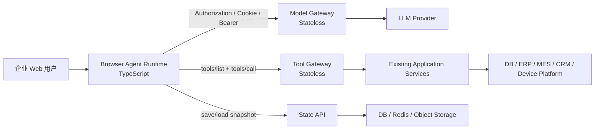
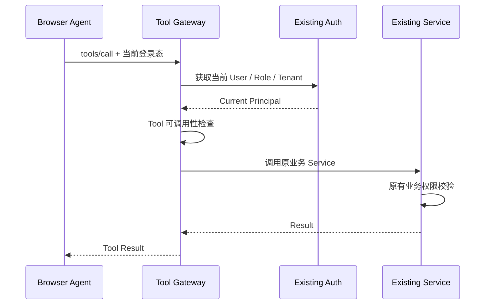
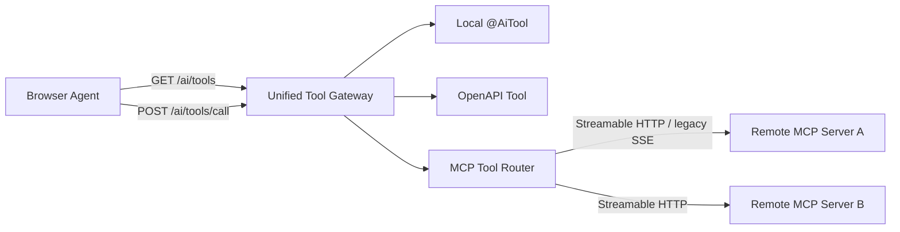
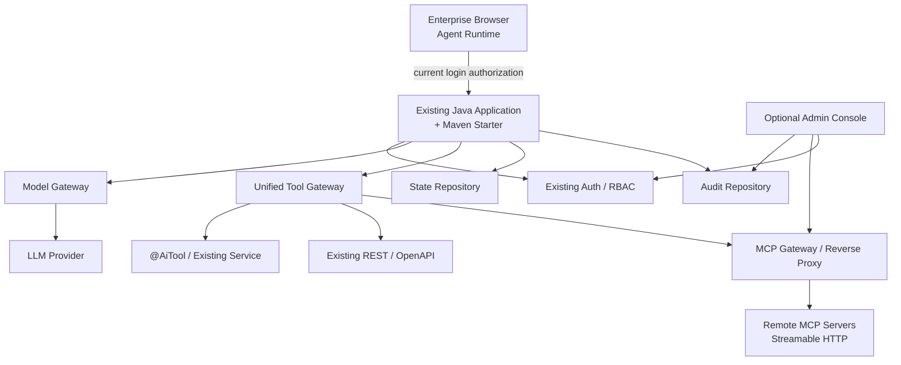
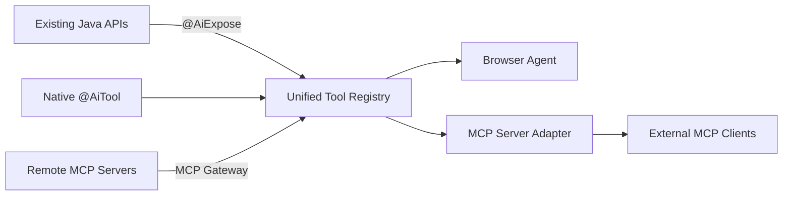
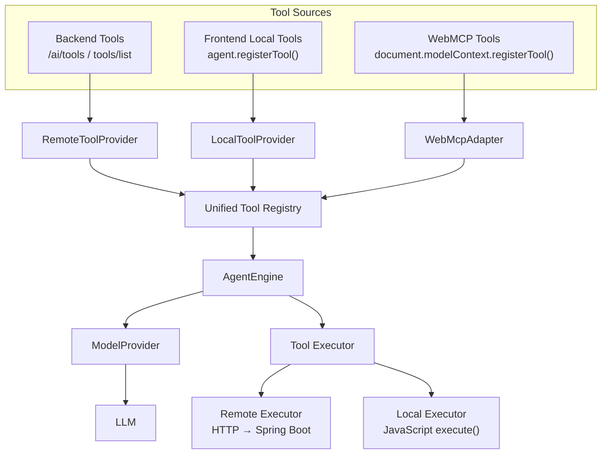
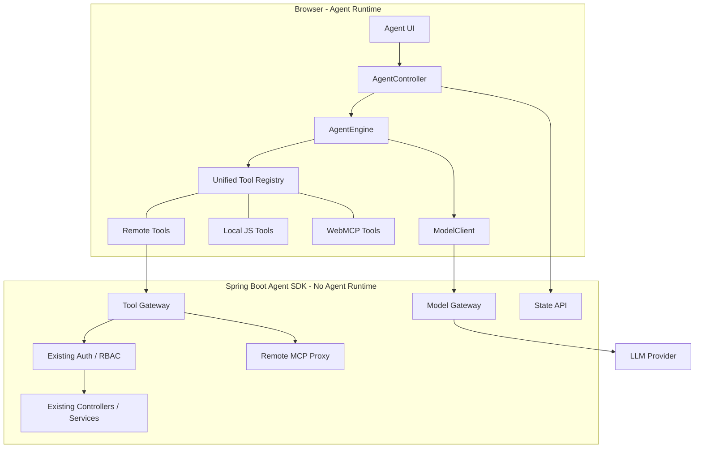

# 面向企业 Web 应用的纯前端 Agent 架构实现方案

> **文档定位**：本文保存完整需求背景和设计演进，不维护实时实施状态。当前完成度、后续
> 顺序和暂缓范围以[《路线图与当前进度》](../roadmap.md)为准；当前代码的架构
> 不变量以[《架构设计：模块化单体、六边形架构与设计模式》](../architecture/overview.md)
> 和相关 ADR 为准。

<aside>
🎯

**项目定位**：面向现有企业 Web 应用，以极低侵入方式集成 Agentic AI 能力。Agent Runtime 运行在浏览器；Java 后端不运行 Agent，只提供模型代理、Tool 暴露/调用、状态持久化以及对现有权限体系的适配。

核心目标不是再造一个 Spring AI，而是让 **Java 8 / Spring Boot 2.x 等存量系统也能接入现代 AI Tool Calling**，同时避免 Agent Runtime 成为后端并发瓶颈。

</aside>

## 1. 一句话架构

> **Browser runs Agent，Server runs Business，LLM does Reasoning。**
> 

浏览器负责：Agent Loop、上下文、Tool 调度、短期运行状态、Human-in-the-loop。

后端负责：复用现有登录 Authorization、Tool 执行、模型 API 代理、状态保存、审计与策略控制。

后端**不负责**：Agent Loop、Agent Session Runtime、Checkpoint 调度、长期驻留的 Agent 实例。



---

## 2. 设计原则

### 2.1 Agent Runtime 必须在浏览器

每个浏览器自行承担：

- Agent Loop
- conversation messages
- tool call / tool result 编排
- context management
- streaming state
- approval state
- abort / retry
- 当前页面上下文

因此 1 万个同时在线用户，不意味着后端需要维护 1 万个 Agent Runtime。后端看到的仍然只是普通的 HTTP/SSE 请求。

### 2.2 后端“无 Agent 状态”，但允许保存 Agent Snapshot

这里要严格区分两个概念：

- **Runtime State**：当前执行到第几步、下一步调哪个 Tool、模型是否继续推理——只存在浏览器。
- **Persisted State**：conversation、snapshot、用户偏好等——后端可以保存，但只作为数据存储，不参与 Agent 执行。

即：**Stateless Runtime + Stateful Storage**。

### 2.3 Tool Executor 无状态，不等于 Tool 无副作用

`createOrder()`、`restartDevice()` 当然可能修改业务系统。

无状态指的是 Tool Gateway 本身不保存“这个 Agent 执行到哪一步”，请求结束后即可释放；业务状态仍然由现有 DB、ERP、MES、CRM 等系统管理。

### 2.4 权限完全复用现有企业系统

AI 调 Tool 和页面 JavaScript 调后端 API，本质上属于同一个安全模型：

```
当前登录用户
    ↓
现有 Cookie / JWT / Authorization
    ↓
现有 Spring Security / Shiro / 自研权限系统
    ↓
Controller / Service 权限检查
    ↓
业务操作
```

框架不重新发明用户体系、角色体系、租户体系和 OAuth 登录。

### 2.5 Spring 不能成为 Core 依赖

核心 Java 模块以 **Java 8** 为最低目标，并且不依赖 Spring。

Spring Boot 只是 Adapter。

---

## 3. 推荐的项目模块结构

```
patchbridge-agent/
│
├── protocol/
│   └── 协议定义、JSON Schema、Tool 描述、State Envelope
│
├── web/
│   ├── agent-core/
│   ├── agent-strands-adapter/
│   ├── model-http-provider/
│   ├── remote-tool-provider/
│   ├── state-client/
│   └── ui-react/                 # 可选
│
├── java/
│   ├── agent-java-core/          # Java 8，无 Spring
│   ├── agent-tool-annotations/
│   ├── agent-json-jackson2/      # 可选
│   ├── agent-schema-victools/    # 可选
│   ├── agent-servlet-javax/      # Java 8 / 老系统
│   ├── agent-servlet-jakarta/    # 新系统
│   ├── agent-spring-boot2-starter/
│   ├── agent-spring-boot3-starter/
│   └── agent-openapi-adapter/    # 可选
│
└── examples/
    ├── springboot2-java8-demo/
    ├── springboot3-demo/
    └── plain-servlet-demo/
```

### 最重要的约束

**公共 API 不要直接暴露 Strands 的类型。**

建议自己定义极薄的：

```
AgentEngine
ModelTransport
ToolProvider
StateRepository
ApprovalHandler
AgentSnapshot
```

然后：

```
AgentEngine
    └── StrandsAgentEngineAdapter
```

第一版内部使用 Strands；将来如果 Strands 不合适，可以换 Agent Engine，而不会让整个项目 API 被上游 SDK 锁死。

---

## 4. Browser 前端架构设计

Browser 层不是一个简单聊天组件，而是整个 Agent Runtime 的宿主。因此必须把 UI、状态、执行引擎和后端 Client 明确分层。

核心设计为：

```
View
  ↓
AgentController
  ↓
AgentState
  ↓
AgentEngine
  ↓
ModelClient / ToolClient

ConversationClient
  ↓
Persistent Conversation API
```

详细设计见：[前端架构设计：AgentController + 单一状态源（v0.1）](https://app.notion.com/p/AgentController-v0-1-3c0bde7d586d818e9a29db0cf0335523?pvs=21)

### 4.1 核心原则

前端长期遵守以下约束：

- **Single Source of Truth**：`AgentState` 是 Browser 唯一业务状态源。
- **DOM Is Not State**：DOM / Virtual DOM 只是 State 的渲染结果。
- **Runtime Hidden Behind Controller**：View 不允许直接读取 `AgentRuntime` 内部字段。
- **Latest Request Wins**：旧异步请求不能覆盖新状态。
- **Engine Replaceable**：Agent 执行引擎可以替换，UI 和 Controller 契约不跟随变化。

### 4.2 AgentController：Browser Application Service

View 唯一依赖 `AgentController`。

Controller 负责：

- 初始化
- 当前 AgentState
- Conversation 列表与切换
- 新建 Conversation
- sendMessage / abort
- Tool Confirmation
- Runtime Event → State 转换
- stale result 防护
- dispose / 生命周期

建议公共契约：

```tsx
export interface PatchBridgeAgentController {
  getState(): AgentState;
  subscribe(listener: (state: AgentState) => void): () => void;
  initialize(preferredConversationId?: string | null): Promise<void>;
  refreshConversations(): Promise<void>;
  loadConversation(id: string): Promise<void>;
  startNewConversation(): void;
  sendMessage(text: string): Promise<void>;
  approveTool(): void;
  rejectTool(): void;
  abort(): void;
  dispose(): void;
}
```

View 只做：

```
subscribe(state)
render(state)
dispatch user intent
```

禁止：

```
View → AgentRuntime
View → ModelClient
View → ToolClient
View → ConversationClient
View → localStorage 作为业务状态
```

### 4.3 AgentState：唯一状态源

建议：

```tsx
export interface AgentState {
  status:
    | 'idle'
    | 'loading-conversations'
    | 'loading-conversation'
    | 'loading-tools'
    | 'streaming'
    | 'waiting-confirmation'
    | 'calling-tool'
    | 'saving'
    | 'done'
    | 'error';

  conversation: Conversation | null;
  conversations: readonly Conversation[];
  messages: readonly ChatMessage[];

  streamingAssistant: {
    content: string;
    reasoning: string;
  } | null;

  pendingConfirmation: ToolConfirmation | null;
  error: AgentError | null;
}
```

`messages` 只保存稳定、已提交消息；正在生成的 assistant message 单独放在 `streamingAssistant`。这样 Streaming 不需要依赖 DOM 节点保存临时状态。

### 4.4 AgentEngine：执行引擎契约

Controller 不绑定具体 Agent SDK。

建议：

```tsx
export interface AgentEngine {
  run(input: AgentRunInput): Promise<AgentRunResult>;
  abort(): void;
  dispose(): void;
  subscribe(listener: (event: AgentEngineEvent) => void): () => void;
}
```

v0.1 可以继续使用当前 `AgentRuntime` 作为默认实现：

```
AgentController
      ↓
AgentEngine
      ↓
DefaultAgentRuntime
```

未来可以增加：

```
StrandsAgentEngine
CustomAgentEngine
```

因此 Strands 是**可选 Engine Adapter**，不是 Browser 公共 API 的基础依赖。

这比第一版直接把 UI 绑定到 Strands 更符合项目总原则：

> **Core defines contracts. Starter provides defaults. Applications keep control.**
> 

### 4.5 Engine Event

Runtime / Engine 不允许要求 View 读取内部数组，而是通过统一事件向 Controller 发布：

```tsx
export type AgentEngineEvent =
  | { type: 'status'; status: AgentStatus }
  | { type: 'messages'; messages: readonly ChatMessage[] }
  | { type: 'conversation'; conversation: Conversation | null }
  | { type: 'delta'; text: string }
  | { type: 'reasoning'; text: string }
  | { type: 'tool-call'; toolCall: ToolCall }
  | { type: 'tool-result'; result: ToolResult }
  | { type: 'error'; error: Error };
```

关键要求是稳定消息改变时发布 `messages snapshot`。

### 4.6 异步并发：Latest Request Wins

Conversation Navigation 必须同时使用：

```
AbortController
+
Generation Token
```

处理流程：

```
start new navigation
↓
abort previous
↓
generation++
↓
request
↓
response checks generation
↓
only latest generation can commit state
```

Abort 用来停止工作，Generation 用来阻止旧结果提交。

这用于解决：

- 快速切换 Conversation
- initialize 与 new conversation 冲突
- endpoint / session context 改变
- 旧请求晚返回覆盖新状态

### 4.7 Tool Confirmation

Human-in-the-loop 由 Controller 管理：

```
Engine requests confirmation
↓
Controller sets waiting-confirmation
↓
View renders approval UI
↓
approveTool / rejectTool
↓
Controller resolves Engine request
```

DOM 不保存 Promise Resolver；Controller dispose 时 pending confirmation 必须自动 reject。

### 4.8 Conversation 与跨设备恢复

Browser 负责 Runtime State，后端负责 Persisted Conversation。

Runtime State：

```
streaming
pending tool
pending confirmation
current run state
```

Persisted Conversation：

```
Conversation
Messages
Tool Calls
Tool Results
Revision
Metadata
```

用户关闭浏览器后，不要求恢复正在执行到一半的 Agent Run；重新登录后从最后一次稳定持久化的 Conversation 继续。

localStorage / IndexedDB 只允许作为 UX Cache，不能成为 Conversation Source of Truth。

### 4.9 Web Component 生命周期

如果默认 UI 使用 Custom Element：

```
connectedCallback
→ register listeners
→ create/connect controller
→ subscribe
→ initialize

disconnectedCallback
→ unsubscribe
→ remove listeners
→ abort
→ dispose when owned
```

重新 connect 后必须恢复完整行为。

当 endpoint、session、agent-id 等依赖配置变化时，优先采用：

```
dispose old controller
→ create new controller
→ subscribe
→ initialize
```

避免旧 Runtime / 旧请求泄漏。

### 4.10 Provider Compatibility

Provider 兼容逻辑只允许存在于 Model Provider 层：

```
AgentEngine
    ↓
ModelProvider
    ├── OpenAiCompatibleProvider
    ├── FutureAnthropicProvider
    ├── FutureGeminiProvider
    └── ApplicationCustomProvider
```

Widget 和 Controller 不应该知道某个 Provider 的 SSE、reasoning 或特殊字段差异。

### 4.11 Browser 安全边界

Browser 从来不是权限安全边界。

即使前端只展示当前用户可见 Tool，`/ai/tools/call` 仍必须在后端重新执行：

```
Authentication
→ ToolAccessPolicy
→ Business ACL
→ Execute
```

Browser Controller 只管理运行态和交互态，不承担最终授权。

### 4.12 Browser 架构不变量

以下规则属于正式设计约束：

1. View 不直接访问 Runtime。
2. DOM 不保存业务状态。
3. AgentState 是 Browser 唯一状态源。
4. stale async result 必须可丢弃。
5. 后端 Conversation 是跨设备持久化 Source of Truth。
6. Engine 必须可替换。
7. Provider workaround 不进入 View / Controller。
8. Tool 权限始终由服务器重新校验。
9. Controller 不能演化成 Server-side Agent Runtime。
10. UI 框架可以替换，但 Controller 契约保持稳定。

---

## 5. Tool 协议：借 MCP 的思想，但第一版不要完整实现 MCP Java Server

最新 MCP Tool 模型已经非常接近我们需要的协议：Tool 有 name、description、inputSchema，并通过 `tools/list` / `tools/call` 完成发现与调用。

因此建议 **数据结构尽量与 MCP 对齐**，但企业系统内部第一版使用更简单的 REST Transport。

### 5.1 Tool 描述

```json
{
  "name": "device_get",
  "title": "查询设备",
  "description": "根据设备序列号查询设备信息",
  "inputSchema": {
    "type": "object",
    "properties": {
      "sn": {
        "type": "string",
        "description": "设备序列号"
      }
    },
    "required": ["sn"]
  },
  "annotations": {
    "readOnlyHint": true,
    "destructiveHint": false,
    "idempotentHint": true
  }
}
```

### 5.2 Tool API

```
GET /ai/tools
```

```
POST /ai/tools/call
Content-Type: application/json

{
  "name": "device_get",
  "arguments": {
    "sn": "100000000001"
  },
  "requestId": "..."
}
```

### 5.3 为什么不直接把官方 MCP Java SDK作为核心依赖

官方 [MCP Java SDK](https://github.com/modelcontextprotocol/java-sdk) 是完整的通用 MCP 实现，包含 Reactive Streams、Reactor、JDK HttpClient、Servlet/Streamable HTTP 等能力；这对于标准 MCP Server 很合理，但对于“Java 8 存量企业 Web 系统嵌 AI”而言偏重，而且其当前默认远程 Client 使用 JDK HttpClient（Java 11+），服务端也面向 Jakarta Servlet 等现代环境。

我们的核心诉求只是：

```
Tool Metadata
Tool Discovery
Tool Invocation
JSON Schema
```

因此第一版自己维护一个非常薄的协议层更合理。

但字段设计尽量 MCP-compatible，将来可以增加：

```
agent-mcp-adapter
```

让同一个 `@AiTool` 同时暴露为企业 Web Agent Tool 和标准 MCP Tool。

---

## 6. Java Core 设计

`agent-java-core` 目标：

- Java 8
- 不依赖 Spring
- 不依赖 Servlet
- 不负责模型调用
- 不负责 Agent Loop
- 不创建线程池
- 不维护用户 Session

核心接口示意：

```java
public interface ToolRegistry {
    List<ToolDefinition> list(ToolRequestContext context);
    ToolResult call(String name, Map<String, Object> arguments,
                    ToolRequestContext context);
}
```

```java
public interface ToolAuthorizationProvider {
    boolean canDiscover(ToolDefinition tool, ToolRequestContext context);
    boolean canInvoke(ToolDefinition tool, ToolRequestContext context);
}
```

```java
public interface AgentStateRepository {
    AgentState load(String userId, String sessionId);
    SaveResult save(String userId, String sessionId,
                    long expectedRevision, AgentState state);
}
```

Core 只定义 SPI，由不同框架提供实现。

---

## 7. `@AiTool` 注解模式

对于需要专门给 AI 暴露的业务能力，提供简单注解：

```java
@AiTool(
    name = "device_get",
    description = "根据序列号查询设备信息",
    readOnly = true
)
public DeviceDTO getDevice(
        @AiParam(value = "设备序列号", required = true)
        String sn,
        AiRequestContext context) {

    return deviceService.getBySn(sn);
}
```

其中 `AiRequestContext` **不能出现在发给 LLM 的 inputSchema 里**。

它由服务器自动注入：

```
userId
tenantId
roles
permissions
locale
traceId
Http request metadata
```

模型永远只能生成：

```json
{
  "sn": "100000000001"
}
```

不能生成：

```json
{
  "tenantId": "别人的租户"
}
```

这对企业多租户系统非常重要。

---

## 8. 第二种 Tool 模式：直接复用现有 REST/OpenAPI

很多企业系统已经存在大量 Controller/API，再写一层 `@AiTool` 会重复劳动。

因此建议后续增加：

```
OpenAPI → Tool Adapter
```

例如：

```java
@AiExposeApi
@GetMapping("/api/device/{sn}")
public DeviceDTO getDevice(...) {}
```

或者通过配置选择 OpenAPI Operation：

```yaml
ai:
  openapi:
    include:
      - GET /api/device/{sn}
      - POST /api/order/query
```

转换：

```
OpenAPI Operation
       ↓
Tool Definition
       ↓
JSON Schema
       ↓
Browser Agent
```

这样企业已经维护好的：

- Controller
- DTO
- Swagger/OpenAPI 描述
- 参数校验
- 登录鉴权
- 角色权限

全部继续复用。

**建议 `@AiTool` 和 OpenAPI Adapter 两条路线同时存在，不强迫用户重写接口。**

---

## 9. JSON Schema：做 SPI，不把某个库绑死在 Core

Tool Calling 最麻烦的基础设施之一是 Java 类型 → JSON Schema。

建议：

```java
public interface ToolSchemaGenerator {
    JsonSchema generate(Method method);
}
```

提供：

1. `SimpleReflectionSchemaGenerator`：自己实现少量 primitive / DTO / List / Enum，保证零复杂依赖。
2. `VictoolsSchemaGeneratorAdapter`：复杂 DTO 推荐使用 [victools/jsonschema-generator](https://github.com/victools/jsonschema-generator)。
3. `OpenApiSchemaGenerator`：已有 Swagger/OpenAPI 时直接复用 Schema。

注意版本隔离：victools 当前 5.x 已明确把最低 Java 提升到 Java 17，因此 Java 8 兼容模块必须使用独立的兼容版本线，不能让它成为 core 的强制依赖。

---

## 10. Spring 适配层

### 10.1 Spring Boot 2 Starter

目标：Java 8 + `javax.*`

负责：

- 扫描 Spring Bean 中的 `@AiTool`
- 注册 ToolRegistry
- 获取当前登录用户
- 对接 Spring Security（如果存在）
- MVC Controller
- Jackson 2
- StateRepository Bean 自动装配

### 10.2 Spring Boot 3/4 Starter

目标：`jakarta.*`

实现同一套 SPI，但单独编译，避免 javax/jakarta 冲突。

### 10.3 Plain Servlet Adapter

为了真正做到“Spring 不是必须”，建议同时做：

```
agent-servlet-javax
```

这样传统 Servlet、老 SSM、甚至非 Spring Web 项目也可以接。

---

## 11. 权限模型

用户的判断是正确的：**AI Tool Call 与普通前端 API Call 不应该创造两套权限系统。**

推荐流程：



需要坚持：

- `tools/list` 根据当前用户过滤，减少无权限 Tool 进入模型上下文。
- `tools/call` 必须再次做权限检查，不能信任浏览器。
- Tool 参数不能包含可信身份字段。
- 原业务 Service 的权限规则仍然是最终安全边界。

---

## 12. Agent 状态保存方案

这个项目建议直接复用 Strands 的 Snapshot 能力，但外面再包一层自己的 Envelope。

不要在数据库里裸存 Strands 内部对象，而存：

```json
{
  "format": "patchbridge-agent-state",
  "version": 1,
  "engine": "strands",
  "engineVersion": "...",
  "revision": 18,
  "updatedAt": "...",
  "snapshot": {}
}
```

浏览器：

```
打开 AI 面板
    ↓
GET /ai/sessions/{id}
    ↓
agent.loadSnapshot(...)
    ↓
继续对话
```

保存：

```
User message 完成
Model response 完成
Tool call 完成
Approval 完成
    ↓
Debounce
    ↓
PUT /ai/sessions/{id}
```

**不要每个 token 都保存。**

### 并发控制

多 Tab/多设备同时编辑同一会话时使用 optimistic locking：

```
PUT /ai/sessions/123
If-Match: 18
```

数据库：

```
session_id
user_id
tenant_id
revision
state_json
created_at
updated_at
```

更新时：

```sql
UPDATE ...
SET revision = revision + 1
WHERE session_id = ?
  AND user_id = ?
  AND revision = ?
```

防止一个旧页面覆盖新状态。

---

## 13. Model Gateway

Model Gateway 只做：

```
Authentication
Authorization
Model Routing
Rate Limit
Token/Cost Policy
Provider Credential
Request Forward
Streaming Forward
Audit/Metrics
```

它**不做**：

```
Agent Loop
Tool Decision
Conversation Orchestration
Agent Memory
Workflow State Machine
```

接口可以保持 OpenAI-compatible，也可以定义统一内部协议。

推荐前端只依赖自己的：

```
ModelTransport.stream(request)
```

由 `StrandsHttpModel` 做 Strands ↔ Gateway Event 的转换。

这样以后可以支持：

- OpenAI Responses
- OpenAI-compatible
- DeepSeek
- Anthropic
- 企业自建模型网关

而不修改 Agent Runtime。

---

## 14. Human-in-the-loop

企业 Web Agent 强烈建议 Tool Metadata 增加风险属性：

```java
@AiTool(
    name = "restart_device",
    description = "重启设备",
    readOnly = false,
    destructive = true,
    requireConfirmation = true
)
```

Browser Runtime 收到工具调用后：

```
Tool Call
    ↓
requireConfirmation == true
    ↓
暂停 Agent
    ↓
显示确认 UI
    ↓
用户确认
    ↓
tools/call
    ↓
继续 Agent Loop
```

这非常符合企业 Web 的交互方式，也比做全自动 Autonomous Agent 更安全。

---

## 15. 高并发模型

传统服务端 Agent：

```
10,000 Users
    ↓
10,000 Agent Runtime / Session / State Machine
    ↓
Server Memory + Redis + Sticky Session + Checkpoint
```

本方案：

```
10,000 Users
    ↓
10,000 Browser Runtime
    ↓
Stateless HTTP/SSE Requests
    ↓
Existing Application Cluster
```

因此被消除的瓶颈主要是：

- Agent Runtime 内存
- 服务端 Conversation Runtime
- Agent Session affinity
- Runtime checkpoint coordination
- Agent orchestration thread/task 管理

仍然存在的容量压力：

- LLM Gateway streaming connections
- 原业务 API
- 数据库
- 状态存储写入
- 模型本身限流

所以正确宣传语应是：

> **Agent Runtime 的并发随客户端水平扩展，不占用企业应用服务器的 Agent Runtime 资源。**
> 

而不是“服务器无限并发”。

---

## 16. 项目明确不解决什么

第一版主动不做：

- Coding Agent
- Shell / Desktop Agent
- 浏览器自动化 Agent
- 数小时后台 Agent
- 定时 Agent
- 用户关页面后继续运行
- Deep Research
- Multi-Agent Swarm
- 分布式 Workflow Engine
- 长期无人值守任务

本项目主要解决：

- ERP Copilot
- MES Assistant
- CRM Assistant
- 运维平台 Assistant
- 设备管理 Assistant
- OA Assistant
- 数据查询 Assistant
- 页面表单辅助
- 短链路业务操作
- 多 Tool 短流程

这个边界越清晰，项目越容易做小、做稳。

---

## 17. 主要局限与对应策略

### 浏览器生命周期

页面关闭后 Agent 停止。

**策略**：明确产品边界；需要后台任务的 Tool 自己创建业务 Job，并返回 `jobId`，Agent 只负责查询 Job 状态，不负责在浏览器里跑几小时。

### 前端代码可见

Tool Schema、System Prompt 的部分内容可以通过 DevTools 看到。

**策略**：任何 Secret、内部凭据和安全规则不得依赖前端保密。

### Context 越来越大

前端仍然会面对 Token 成本和上下文窗口。

**策略**：直接复用 Strands Conversation Manager / Context Manager；第一版只做 Sliding Window + Summarization。

### 多 Tab 状态冲突

**策略**：Snapshot revision + optimistic locking。

### 上游 Agent SDK 变化

**策略**：Strands 永远藏在 Adapter 后面，公共协议与公共 API 不暴露 Strands 类型。

### Java 8 依赖生态越来越老

**策略**：Core 做到依赖极少；现代能力放 Optional Adapter，不强迫老系统升级整个依赖树。

---

## 18. 开源复用矩阵

| 能力 | 建议 | 项目 |
| --- | --- | --- |
| Browser Agent Loop | 直接复用 + Adapter | [Strands Agents](https://github.com/strands-agents/harness-sdk) |
| Agent Snapshot | 直接复用，外包自己的 Envelope | Strands `takeSnapshot/loadSnapshot` |
| Tool 数据模型 | 参考并尽量兼容 | [MCP Tools Specification](https://modelcontextprotocol.io/specification/2026-07-28/server/tools) |
| MCP Client/Server | 第一版非核心；后续做 Adapter | [MCP TypeScript SDK](https://github.com/modelcontextprotocol/typescript-sdk) |
| Java JSON Schema | Optional Adapter | [victools/jsonschema-generator](https://github.com/victools/jsonschema-generator) |
| 已有 REST API 描述 | 复用现有 OpenAPI | Swagger / springdoc / OpenAPI |
| 登录/角色/租户 | 绝不重造 | 企业现有 Authorization System |

---

## 19. 推荐 MVP

### Phase 0：技术验证

只做一个 Demo：

```
Spring Boot 2.7 + Java 8
        +
Browser Strands Agent
        +
1 个 Remote Model Provider
        +
3 个 Remote Tools
        +
Snapshot save/load
```

验证：

- Strands Browser bundle 是否稳定
- Custom Model Provider streaming
- Dynamic Tools
- Agent Snapshot 能否跨刷新恢复
- Cookie/JWT 是否自然透传
- Tool Call 能否拿到当前登录用户

### Phase 1：最小可发布版本

实现：

- `agent-java-core`
- `agent-spring-boot2-starter`
- `@AiTool / @AiParam`
- `/ai/tools`
- `/ai/tools/call`
- `/ai/model/stream`
- `/ai/sessions`
- `agent-web`
- Strands Adapter
- 简单 Chat UI

### Phase 2：企业可用性

加入：

- Spring Boot 3 Adapter
- javax Servlet Adapter
- Tool ACL extension
- Human-in-the-loop
- Audit
- Rate Limit hook
- Context compression
- optimistic locking

### Phase 3：减少企业改造成本

加入：

- OpenAPI → Tool
- Swagger/springdoc Adapter
- Tool Group
- Tool Dynamic Filter
- 页面 Local Tool

### Phase 4：生态兼容

加入：

- MCP Adapter
- 外部 MCP Tool 导入
- `@AiTool` 导出标准 MCP Server
- OpenTelemetry Adapter

---

## 20. 一个理想的最终开发体验

企业 Java 项目：

```xml
<dependency>
    <groupId>io.patchbridge.agent</groupId>
    <artifactId>patchbridge-agent-spring-boot2-starter</artifactId>
    <version>1.0.0</version>
</dependency>
```

业务代码：

```java
@AiTool(
    name = "query_device",
    description = "查询设备实时信息",
    readOnly = true
)
public DeviceInfo queryDevice(
        @AiParam("设备序列号") String sn) {
    return deviceService.query(sn);
}
```

现有的：

```
Spring Security
Shiro
JWT
Session
RBAC
Tenant
Service
DAO
```

全部不动。

前端：

```tsx
const agent = createPatchBridgeAgent({
  endpoint: '/ai',
  sessionId: 'device-assistant'
})

await agent.chat('帮我看看 100000000001 这个设备现在有没有告警')
```

框架自动完成：

```
加载 Snapshot
↓
加载当前用户可用 Tools
↓
LLM 推理
↓
Tool Call
↓
复用当前登录态
↓
调用原业务 Service
↓
Tool Result
↓
继续推理
↓
保存 Snapshot
```

---

## 21. 最关键的架构决策

<aside>
💡

**不要把这个项目做成另一个 Spring AI。**

真正有差异化的地方是：**把 Agent Runtime 从企业 Java 服务端拿走，让现有 Java 系统只需要“暴露业务能力 + 保存状态”，就能获得 Agent 能力。**

</aside>

建议项目长期坚持以下五条规则：

1. **Browser owns Agent Runtime.**
2. **Backend owns Security and Business.**
3. **State storage is not Agent runtime.**
4. **Spring is an Adapter, never the Core.**
5. **Reuse standards and open-source Agent engines; only build the enterprise integration layer that does not already exist.**

---

## 22. 当前推荐技术选型结论

**前端 Agent Engine**：Strands Agents TypeScript（通过自研 Adapter 隔离）。

**Tool Protocol**：自研轻量 HTTP Transport，但 Tool Schema 尽量对齐 MCP 2026-07-28。

**状态**：直接利用 Strands Snapshot，服务端保存自研 versioned envelope。

**Java Core**：Java 8、零 Spring、SPI 设计。

**Spring**：Boot 2 / Boot 3 分开做 Adapter。

**Tool Schema**：自研简单 Reflection Generator + 可选 victools/OpenAPI Adapter。

**权限**：100% 复用现有用户登录、RBAC、租户与 Service 权限。

**模型**：前端 Custom Model Provider → Stateless Model Gateway。

**MCP**：先兼容数据模型，后做 Adapter，不让完整 MCP Runtime 抬高 Java 基线。

### 参考项目

- [Strands Agents Harness SDK](https://github.com/strands-agents/harness-sdk)
- [Strands TypeScript Browser Agent 介绍](https://strandsagents.com/blog/strands-agents-typescript-sdk/)
- [Strands Custom Model Provider](https://strandsagents.com/docs/user-guide/concepts/model-providers/custom_model_provider/)
- [Strands StateStore / Snapshot](https://strandsagents.com/docs/api/typescript/Agent/)
- [MCP 2026-07-28 Tools](https://modelcontextprotocol.io/specification/2026-07-28/server/tools)
- [MCP TypeScript SDK](https://github.com/modelcontextprotocol/typescript-sdk)
- [MCP Java SDK](https://github.com/modelcontextprotocol/java-sdk)
- [victools/jsonschema-generator](https://github.com/victools/jsonschema-generator)

---

# 15. 产品化补充：Maven Starter、RBAC Demo、管理后台与 MCP Gateway

<aside>
🧱

这一版把项目目标进一步收敛为：**一个面向企业 Web 应用的 Maven 依赖包 + Demo + 可选管理后台 + MCP HTTP 反向代理能力。**

使用体验遵循“**约定大于配置**”：业务系统引入 Maven 依赖、配置模型与存储、声明少量 Tool 或 MCP Server，即可启用 Agent 能力；现有登录、角色、权限、Session/JWT 都继续复用。

</aside>

## 15.1 最终产品形态

建议不要把它做成一个必须单独部署的平台，而是优先做成“**嵌入式 AI Runtime Starter**”。

```
Existing Enterprise Application
        +
patchbridge-agent-spring-boot-starter
        +
optional patchbridge-agent-admin-starter
        ↓
获得：
- /ai/model/**
- /ai/tools
- /ai/tools/call
- /ai/state/**
- /ai/mcp/**
- /ai/admin/**
- Browser Agent SDK / Widget 静态资源
```

同时发布一个完整 Demo：

```
patchbridge-agent-demo
├── Java 8
├── Spring Boot 2.7
├── Spring Security RBAC
├── H2 / MySQL
├── Local @AiTool
├── OpenAPI Tool
├── Remote MCP Tool
├── Browser Agent
└── Admin Console
```

Demo 的目的不是展示复杂业务，而是展示“一个典型老企业系统如何在不升级 JDK、不替换权限体系的情况下加入 AI”。

---

# 16. 技术栈说明

| 层 | 推荐技术 | 说明 |
| --- | --- | --- |
| Java Core | Java 8 | 核心 SPI、Tool Registry、State Repository、Audit SPI，不依赖 Spring |
| 构建 | Maven Multi-Module | 面向 Java 企业生态，Starter/BOM/依赖管理更自然 |
| Spring Boot 适配 | Spring Boot 2.7 Starter + Spring Boot 3 Adapter | 优先把 Java 8 / Boot 2.x 存量系统作为第一目标 |
| JSON | Jackson 2 Adapter | 企业 Java 项目覆盖面大；Core 只暴露 JSON SPI |
| JSON Schema | victools/jsonschema-generator Adapter + 简单反射实现 | 复杂 DTO 不重复造轮子 |
| 前端语言 | TypeScript | Agent Runtime、Tool Adapter、状态同步 |
| 前端 Agent | Strands Agents TypeScript Adapter | 复用 Agent Loop、Streaming、Context、Tool Calling、Snapshot |
| 前端构建 | Vite | 同时产出 npm SDK 与可直接由 Starter 提供的浏览器 Bundle |
| 嵌入式 UI | Web Component 优先，React Adapter 可选 | 避免强迫企业现有 Vue/React/Angular/JSP 项目迁移框架 |
| HTTP Client | OkHttp Java 8 Adapter | 用于模型网关和 Java 8 MCP HTTP Client；避免依赖 JDK 11 HttpClient |
| 状态存储 | JDBC / Redis SPI | 默认 JDBC，Redis 作为可选实现 |
| 审计 | JDBC AuditRepository + OpenTelemetry Adapter | 管理后台查调用记录；后续接企业链路追踪 |
| 管理后台 | Vue 3 或 React 独立构建后打包进 admin-starter | 运行时只提供静态产物，不给宿主系统增加 Node 依赖 |
| Demo 权限 | Spring Security RBAC | 只作为示例；框架本身不绑定 Spring Security |

## 16.1 为什么嵌入式聊天 UI 推荐 Web Component

企业系统前端形态非常杂：

- Vue 2 / Vue 3
- React
- Angular
- JSP / Thymeleaf
- jQuery 老系统

如果基础 UI 直接绑定 React，会把集成门槛抬高。因此第一版建议输出：

```html
<script src="/ai/assets/patchbridge-agent.js"></script>
<patchbridge-agent endpoint="/ai"></patchbridge-agent>
```

高级项目再使用 npm 包：

```jsx
import { createAgentController } from '@patchbridge-agent/agent';
```

这样“只引 Maven 依赖也能用”和“前端可深度定制”可以同时满足。

---

# 17. Maven 产品结构与“约定大于配置”

推荐最终 Maven 模块：

```
patchbridge-agent-parent
├── patchbridge-agent-bom
├── patchbridge-agent-core
├── patchbridge-agent-protocol
├── patchbridge-agent-tool-annotations
├── patchbridge-agent-schema-core
├── patchbridge-agent-schema-victools
├── patchbridge-agent-storage-jdbc
├── patchbridge-agent-storage-redis
├── patchbridge-agent-mcp-core
├── patchbridge-agent-mcp-http-java8
├── patchbridge-agent-spring-boot2-autoconfigure
├── patchbridge-agent-spring-boot2-starter
├── patchbridge-agent-spring-boot3-autoconfigure
├── patchbridge-agent-spring-boot3-starter
├── patchbridge-agent-admin-core
├── patchbridge-agent-admin-starter
└── patchbridge-agent-demo
```

## 17.1 用户最简单的接入方式

理想情况下，Boot 2 / Java 8 项目只需要：

```xml
<dependency>
    <groupId>io.patchbridge.agent</groupId>
    <artifactId>patchbridge-agent-spring-boot2-starter</artifactId>
    <version>${patchbridge-agent.version}</version>
</dependency>
```

然后：

```yaml
patchbridge-agent:
  model:
    base-url: https://llm-gateway.example.com
    model: deepseek-chat
  state:
    type: jdbc
```

框架自动完成：

```
1. 扫描 @AiTool
2. 生成 Tool Schema
3. 注册 /ai/tools
4. 注册 /ai/tools/call
5. 注册 Model Gateway
6. 注册 State API
7. 读取当前登录用户
8. 注册 Audit Interceptor
9. 提供 Agent Browser Bundle
```

## 17.2 零配置默认值

建议默认约定：

```yaml
patchbridge-agent:
  enabled: true
  base-path: /ai
  tools:
    scan: true
  audit:
    enabled: true
  state:
    enabled: true
  admin:
    enabled: false
  mcp:
    enabled: true
```

如果应用中已经存在：

- `DataSource`：默认启用 JDBC State/Audit Repository；
- Spring Security：自动使用当前 `Authentication`；
- Servlet Session：可以自动拿 session/user 信息，但不要依赖 session 保存 Agent Runtime；
- Jackson：直接复用宿主 `ObjectMapper`；
- Micrometer/OpenTelemetry：存在时自动挂接观测能力。

原则：**能从宿主系统推断出来的，不要求用户再配置一次。**

## 17.3 可覆盖，但不要强迫覆盖

所有自动能力都设计为 SPI：

```java
@Bean
public AgentIdentityProvider customIdentityProvider() { ... }

@Bean
public ToolAuthorizationProvider customToolAuthorization() { ... }

@Bean
public AgentStateRepository customStateRepository() { ... }
```

用户提供自己的 Bean 后，AutoConfiguration 自动退让。

---

# 18. Demo：使用 RBAC，而框架不绑定 RBAC 实现

Demo 建议使用最典型的：

```
User
 ↓ N:M
Role
 ↓ N:M
Permission
```

示例表：

```
sys_user
sys_role
sys_permission
sys_user_role
sys_role_permission
```

演示角色：

```
ROLE_USER
ROLE_OPERATOR
ROLE_AUDITOR
ROLE_ADMIN
```

演示权限：

```
ai:chat:use
ai:tool:device:read
ai:tool:device:restart
ai:trace:self
ai:trace:all
ai:mcp:view
ai:mcp:manage
ai:admin:access
```

注意：框架内部不要硬编码这些 Role。

框架判断的是抽象权限：

```java
boolean canInvoke(ToolDefinition tool, AgentIdentity identity);
```

Demo 的 `SpringSecurityToolAuthorizationProvider` 只是其中一个实现。

这样企业接入时，无论是：

- Spring Security
- Apache Shiro
- Sa-Token
- 自研 RBAC
- JWT Claims
- 网关透传 Header

都可以通过 Adapter 接入。

---

# 19. 管理后台：查看不同用户的 Agent 调用记录

建议管理后台作为**可选 Starter**：

```xml
<dependency>
    <groupId>io.patchbridge.agent</groupId>
    <artifactId>patchbridge-agent-admin-starter</artifactId>
</dependency>
```

启用：

```yaml
patchbridge-agent:
  admin:
    enabled: true
    path: /ai-admin
```

访问：

```
https://host/ai-admin
```

## 19.1 管理后台第一版功能

### 总览

- 今日 Agent 会话数
- 活跃用户数
- LLM 请求数
- Tool 调用数
- MCP Tool 调用数
- 成功率 / 错误率
- P50 / P95 延迟
- Token 使用量（模型返回 usage 时）

### 用户调用记录

按以下字段过滤：

- userId / username
- tenantId
- sessionId / conversationId
- traceId
- model
- Tool 名
- Tool 来源：LOCAL / OPENAPI / MCP
- MCP Server
- 时间范围
- 成功 / 失败

### 单次 Trace 详情

建议呈现：

```
User Question
  ↓
LLM Request
  ↓
Tool Call: device_get
  ↓
Tool Result
  ↓
LLM Request
  ↓
MCP Tool Call: inventory.query
  ↓
MCP Result
  ↓
Final Answer
```

但审计数据和 Agent Runtime State 要分离：**后台用于查询历史事实，不负责恢复或推进 Agent。**

## 19.2 Audit 数据结构

```
agent_trace
- trace_id
- conversation_id
- user_id
- username
- tenant_id
- model
- started_at
- finished_at
- status
- input_tokens
- output_tokens

agent_invocation
- invocation_id
- trace_id
- sequence
- type            # MODEL / TOOL / MCP_TOOL
- source
- name
- request_json
- response_json
- started_at
- finished_at
- duration_ms
- status
- error_code
- error_message
```

### 必须支持脱敏

企业数据不能默认把所有 Tool 入参、返回值原样存库。

提供：

```java
public interface AuditSanitizer {
    Object sanitizeRequest(...);
    Object sanitizeResponse(...);
}
```

并允许：

```java
@AiSensitive
private String idCard;
```

或者配置：

```yaml
patchbridge-agent:
  audit:
    payload-mode: metadata-only   # full / metadata-only / none
```

## 19.3 管理后台权限继续复用宿主系统

不要做第二套管理员账户。

管理后台访问 `/ai-admin/**` 时仍由当前企业系统权限体系决定。

Demo 中：

```
ROLE_ADMIN   → 查看全部
ROLE_AUDITOR → 查看全部 Trace，但不能修改 MCP 配置
ROLE_USER    → 可选，只能看自己的历史
```

---

# 20. MCP Gateway：把远程 MCP 转换成统一的前端 Tool API

这个设计非常适合当前架构。

它不应该让 Browser Agent 自己实现 MCP Client，而应该让后端成为：

> **MCP Client + Tool Gateway + Protocol Bridge**
> 

整体架构：



**前端永远不需要知道一个 Tool 到底来自 Java 方法、REST API 还是 MCP。**

## 20.1 Tool 聚合

后端 `ToolCatalog` 做三路聚合：

```
LocalToolProvider
OpenApiToolProvider
McpToolProvider
        ↓
UnifiedToolCatalog
        ↓
GET /ai/tools
```

为了避免冲突，MCP Tool 建议默认命名空间：

```
local.device_get
openapi.order_query
mcp.ops.restart_service
mcp.inventory.query_stock
```

也允许通过配置重命名。

## 20.2 MCP 反向调用链

```
Browser Agent
    ↓
POST /ai/tools/call
{
  "name": "mcp.inventory.query_stock",
  "arguments": { ... }
}
    ↓
ToolRouter
    ↓
McpToolProvider
    ↓
查找 inventory MCP Server 配置
    ↓
转换为 MCP tools/call JSON-RPC
    ↓
Remote MCP Server
    ↓
解析 application/json 或 SSE response stream
    ↓
标准化为 ToolResult
    ↓
Browser Agent
```

这不是单纯的 TCP/HTTP 透明代理，而是一个**语义级 MCP Bridge**：

```
PatchBridge Agent Tool Protocol
           ↕
MCP Protocol
```

因此后端可以统一做：

- 当前用户鉴权
- Tool ACL
- Audit
- Rate Limit
- 超时
- 熔断
- 参数/结果大小限制
- MCP Server 隔离
- Tool 名冲突处理

---

# 21. MCP Transport 策略

截至 MCP `2026-07-28`，远程标准 Transport 的主路径是 **Streamable HTTP**。该版本进一步移除了协议级 session 和旧的 GET stream：每个请求是独立 POST，响应可以是单个 JSON，也可以是只属于该请求的 SSE 流。

旧的 HTTP+SSE Transport 已被官方弃用，但仍存在兼容窗口。

因此本项目建议：

```
v1：
✅ Streamable HTTP 2026-07-28（默认）
✅ HTTP+SSE legacy（兼容模式，可选）
❌ stdio
❌ 本地进程拉起
❌ WebSocket 自定义 MCP Transport
```

理由：我们的应用场景是“企业 Web 应用访问远程 MCP 服务”，不需要桌面 Agent 常见的 stdio 子进程模式。

参考：

- [https://modelcontextprotocol.io/specification/2026-07-28/basic/transports](https://modelcontextprotocol.io/specification/2026-07-28/basic/transports)
- [https://blog.modelcontextprotocol.io/posts/2026-07-28/](https://blog.modelcontextprotocol.io/posts/2026-07-28/)

## 21.1 Streamable HTTP 与本架构非常匹配

MCP `2026-07-28` 已经转向 stateless protocol core：请求可由普通负载均衡器分发到任意实例；`tools/list` 还支持 TTL/cache scope。

这意味着我们可以：

```
GET /ai/tools
    ↓
McpToolCatalog
    ↓
tools/list
    ↓
按照 MCP ttlMs 缓存
```

无需每次 Browser Agent 请求都重新拉远程 Tool List。

同时 Tool 调用本身：

```
Browser → 本应用 → Remote MCP
```

仍然保持请求级无状态。

---

# 22. Java 8 下的 MCP 实现策略

这里不能为了“不重复造轮子”而直接把整个官方 MCP Java SDK塞进 Core。

当前官方 MCP Java SDK 的默认远程 Client 采用 JDK `HttpClient`（Java 11+），同时其完整 SDK 带有 Reactive Streams/Reactor 等通用 MCP 能力。对于我们的 Java 8 存量系统目标来说并不理想。

因此建议做一个**非常窄的 MCP Client SPI**：

```java
public interface RemoteMcpClient {
    McpServerInfo discover(McpServerConfig config);
    List<McpToolDefinition> listTools(McpServerConfig config);
    McpCallResult callTool(McpServerConfig config,
                           String name,
                           Map<String, Object> arguments,
                           McpCallContext context);
}
```

第一版 Java 8 Adapter 只实现项目真正需要的子集：

```
server/discover（可选）
tools/list
tools/call
Streamable HTTP response parsing
legacy SSE compatibility
```

HTTP、连接池、TLS、SSE 不自己造轮子，复用 OkHttp；JSON 复用 Jackson。

这叫：**自己维护很薄的 MCP Protocol Adapter，而不是自己写 HTTP/SSE 基础设施。**

后续 Java 11/17 环境可以再提供：

```
patchbridge-agent-mcp-official-sdk-adapter
```

在兼容版本成熟时直接桥接官方 MCP Java SDK。

---

# 23. MCP 配置体验

目标仍然是约定大于配置。

示例：

```yaml
patchbridge-agent:
  mcp:
    enabled: true
    servers:
      inventory:
        url: https://inventory.example.com/mcp
        transport: streamable-http
        enabled: true
        timeout: 30s

      ops:
        url: https://ops.example.com/mcp
        transport: streamable-http
        enabled: true
        tool-prefix: mcp.ops
        auth:
          type: bearer
          token: ${OPS_MCP_TOKEN}
```

然后：

```
应用启动
 ↓
读取 MCP Server Config
 ↓
拉取 tools/list
 ↓
转换成 Unified ToolDefinition
 ↓
GET /ai/tools 自动出现 MCP Tools
```

## 23.1 不要默认把用户 Authorization 转发给 MCP Server

本系统前端到本应用：

```
Authorization = 当前企业登录用户身份
```

但本应用到第三方 MCP：

```
不能默认复制原 Authorization Header
```

否则可能把企业 JWT 泄漏给另一个域。

建议 MCP Auth 显式配置：

```
NONE
STATIC_BEARER
STATIC_HEADER
OAUTH_CLIENT_CREDENTIALS
CUSTOM
```

只有显式声明时才允许：

```
FORWARD_SELECTED_HEADERS
```

而且只允许白名单 Header。

---

# 24. MCP Tool 仍然受本系统 RBAC 控制

远端 MCP Server 返回：

```
restart_service
delete_cache
query_metrics
```

并不意味着当前登录用户都能调用。

在导入时生成本地逻辑 Tool：

```
mcp.ops.restart_service
mcp.ops.delete_cache
mcp.ops.query_metrics
```

然后继续经过：

```
Current User
    ↓
Existing RBAC
    ↓
ToolAuthorizationProvider
    ↓
允许 / 拒绝
    ↓
MCP Proxy
```

配置可以覆盖权限：

```yaml
patchbridge-agent:
  mcp:
    servers:
      ops:
        tools:
          restart_service:
            permission: ai:mcp:ops:restart
          query_metrics:
            permission: ai:mcp:ops:read
```

这样“远程 MCP 自己有什么 Tool”和“企业用户能调用哪些 Tool”完全解耦。

---

# 25. 管理后台同时管理 MCP 运行状态

后台建议增加一个 **MCP Servers** 页面：

| 字段 | 用途 |
| --- | --- |
| Name | MCP Server 配置名 |
| Endpoint | 远程 URL，敏感部分可隐藏 |
| Transport | Streamable HTTP / Legacy SSE |
| Status | UP / DOWN / DEGRADED |
| Tool Count | 当前发现的工具数量 |
| Last Refresh | 最近一次 tools/list |
| Latency | 最近探测耗时 |
| Error | 最近一次连接/协议错误 |

第一版建议配置仍来自 YAML，不急着做后台在线修改配置。

后台先做：

```
查看状态
查看 Tool List
手工 Refresh
测试连接
查看 MCP 调用 Trace
```

第二阶段再考虑 DB 动态配置。

原因是“配置中心”很容易把项目带向全功能 AI 平台，偏离轻量 Starter 的定位。

---

# 26. 更新后的整体架构



核心不变：

> **Agent Runtime 在客户端；业务权限、Tool 执行、状态持久化、审计和 MCP 出口在现有企业后端。**
> 

---

# 27. 我认为现在最合理的 MVP

不要第一版就全部实现。

建议 MVP 明确做到以下闭环：

1. `patchbridge-agent-core`：Java 8、无 Spring。
2. `patchbridge-agent-spring-boot2-starter`：引入依赖即自动注册端点。
3. `@AiTool`：扫描 + Schema + 调用。
4. Browser Agent：Strands Adapter。
5. Model Gateway：HTTP Streaming。
6. JDBC Agent State：save/load snapshot。
7. JDBC Audit：记录用户、模型、Tool、耗时、结果状态。
8. Spring Security RBAC Demo。
9. Admin Console：用户 Trace 查询 + MCP 状态查询。
10. MCP Streamable HTTP Proxy：`tools/list` + `tools/call`。
11. legacy SSE MCP 作为兼容 Adapter，不影响核心模型。
12. 完整 Demo：Java 8 + Spring Boot 2.7 + H2 一键运行。

MVP 成功标准应该非常具体：

> 一个已有 Spring Boot 2.7 / Java 8 项目，只引入 Maven Starter、写少量 YAML、加几个 `@AiTool` 或 MCP Server 地址，就可以在现有登录体系下使用浏览器 Agent；管理员能够按用户查看调用 Trace；Browser Agent 能无感调用本地 Tool 和远程 MCP Tool。
> 

这会是这个项目最清晰、最有竞争力的第一版。

---

# 21. v0.1 冻结决策（开工前最终收口）

<aside>
✅

**v0.1 的目标不是做完整 Agent 平台，而是验证并交付一个可嵌入现有企业 Web 系统的轻量 Agent Starter。**

核心原则：默认实现尽量简单；所有可能与企业现有架构冲突的能力都通过 SPI / Hook 开放给开发者接管。

</aside>

## 21.1 第一版本地交付，不发布 Maven/npm 仓库

v0.1 暂不发布 Maven Central 和 npm registry。

- Java 多模块工程本地构建、安装或直接作为同一仓库模块引用。
- 前端 Agent Bundle 本地构建后，由 Demo / Starter 以静态资源方式加载。
- Maven/npm 正式发布、版本治理、CDN 等放到后续版本。

第一版重点是验证架构和开发体验，不把精力消耗在发布流程上。

## 21.2 RBAC：尽量复用，但不假设企业权限系统实现

框架不能假设企业一定使用 Spring Security、Shiro 或某一种 RBAC 表结构。

因此 RBAC 设计为：**默认实现 + SPI 可完全替换**。

核心 SPI 建议：

```java
public interface CurrentUserProvider {
    UserContext currentUser(AiRequestContext request);
}

public interface ToolAccessPolicy {
    boolean canDiscover(UserContext user, ToolDefinition tool);
    boolean canInvoke(UserContext user, ToolDefinition tool);
}
```

第一版提供：

- Spring Security Adapter：从现有 `SecurityContext` 获取登录用户和角色。
- `AuthenticatedToolAccessPolicy`：默认仅允许已登录用户使用 AI Tool。
- Demo 提供 RBAC 实现，展示 `ROLE_ADMIN / ROLE_USER / ROLE_AUDITOR`。
- 企业用户可以自己实现 `CurrentUserProvider` 和 `ToolAccessPolicy`，接入 Shiro、自研权限平台、租户权限系统等。

`@AiTool` 可提供可选元数据：

```java
@AiTool(
    name = "device_restart",
    description = "重启设备",
    permissions = {"device:restart"}
)
```

但 `permissions` 只是**权限标识**，框架不负责创建或维护权限体系；真正的判断由 `ToolAccessPolicy` 完成。

如果业务 Service 自己已经执行权限校验，则继续保留业务层校验，AI Tool 不应绕过它。

## 21.3 开放性原则：默认实现全部可替换

第一版公共扩展点至少包括：

```
CurrentUserProvider
ToolAccessPolicy
ToolProvider / ToolRegistry
ToolNamingStrategy
ConversationOwnerResolver
ConversationRepository
AuditSink
AuditRedactor
ModelProvider
McpClientTransport
McpCredentialStore
SecretCipher
ToolCallInterceptor
ModelCallInterceptor
```

设计原则：

> **Core 定义协议和生命周期，Starter 提供默认实现，业务项目永远可以替换默认实现。**
> 

不要为了“方便”把企业业务逻辑硬编码进框架。

## 21.4 MCP Gateway v0.1 范围锁定

第一版 MCP 只支持远程 HTTP MCP，并且只聚合 **Tools**。

支持：

```
server/discover（可选）
tools/list
tools/call
Streamable HTTP
legacy HTTP+SSE（兼容模式，可选）
```

不支持：

```
stdio
resources
prompts
tasks
MCP Apps
sampling
完整 OAuth 授权流程
用户自定义 MCP
```

前端 Agent 永远只调用统一接口：

```
GET  /ai/tools
POST /ai/tools/call
```

后端负责将 MCP Tool 转换成统一 Tool Definition，并将 Tool Call 代理到远程 MCP Server。

## 21.5 MCP 只能由后台运维配置

普通 Web 用户不需要知道 MCP 的存在，也不能自行添加 MCP Server。

MCP Server 由后台管理系统统一配置：

```
名称
URL
启用状态
namespace
transport
timeout
认证方式
Tool include/exclude
允许哪些角色/权限使用
```

浏览器端传入的 `Authorization`、Cookie 或任意用户 Header **不得直接透传给远程 MCP Server**。

企业 Web 登录态只用于访问本项目自身的 `/ai/*` 接口。

## 21.6 MCP v0.1 认证模式

第一版支持企业中最常见的服务端固定凭据：

```
NONE
BASIC_AUTH          username + password
BEARER_TOKEN        Authorization: Bearer xxx
API_KEY_HEADER      自定义 Header Name + Secret
STATIC_HEADERS      高级模式，配置固定 Header
```

这里的 Basic Auth 是标准 HTTP Basic Authentication。

第一版不实现用户交互式 OAuth。

所有 MCP Credential 都由后台管理员配置，浏览器用户不可见。

凭据存储通过：

```java
McpCredentialStore
SecretCipher
```

两个 SPI 隔离。

默认数据库实现应加密保存 Secret；加密主密钥来自宿主应用配置/环境变量，不存进数据库。

## 21.7 MCP Tool 命名空间

聚合多个 Tool Source 时必须避免重名。

内部统一 Tool ID 建议：

```
local.device_get
local.device_restart
mcp.inventory.search
mcp.crm.search_customer
```

MCP 规范允许工具代理在聚合多个 Server 时使用 Server Identifier 前缀进行消歧，因此这种命名方式与协议方向一致。

`ToolNamingStrategy` 对外开放，企业可自定义命名规则。

## 21.8 状态保存的真实目标：跨刷新、跨设备继续对话

v0.1 **不恢复执行到一半的 Agent Runtime**。

状态持久化只解决：

- 浏览器刷新后继续历史对话
- 浏览器关闭后再次登录继续对话
- 换电脑/换浏览器登录后继续同一个会话

因此服务端保存的是**持久化 Conversation State**，而不是 Strands Runtime Object。

推荐模型：

```
AgentConversation
├── conversationId
├── userId
├── title
├── revision
├── createdAt
├── updatedAt
└── status

AgentMessage
├── messageId
├── conversationId
├── sequence
├── role
├── content
├── messageType
├── toolCallId
└── createdAt
```

Browser 加载 Conversation + Messages 后重新构建 Agent 上下文。

保存策略：**每一个完整回合完成后提交**；必要时 Tool Result 完成后可以增量保存。

如果用户在 Agent 正执行到一半时直接关闭页面，该未完成回合允许被中断；重新打开后从最后一个已提交状态继续。

这能避免数据库状态格式绑定 Strands Snapshot，同时满足实际 Web 场景的“继续对话”需求。

## 21.9 Audit：框架负责事件，不替开发者决定数据策略

Audit 默认记录：

```
traceId
conversationId
userId
eventType
model/tool
source(local/openapi/mcp)
status
duration
token usage（可获得时）
timestamp
```

Prompt、Tool Arguments、Tool Result 等敏感 Payload 是否保存由配置决定。

开放：

```java
public interface AuditRedactor {
    Object redact(AuditContext context, Object payload);
}

public interface AuditSink {
    void write(AuditEvent event);
}
```

企业可以自己实现脱敏、过滤、写 ELK、写数据库或对接审计平台。

框架默认实现不能成为企业数据治理的强制方案。

## 21.10 Model Gateway v0.1

第一版只提供：

```
OpenAI-compatible streaming ModelProvider
```

Browser 统一访问：

```
POST /ai/model/stream
```

模型 URL、Model Name、Credential 都由后端配置。

Core 保留 `ModelProvider` SPI，因此以后可以增加 Anthropic、Gemini、Bedrock、Azure OpenAI、自研模型协议等，而不修改 Browser Agent 的公共调用流程。

## 21.11 Tool 调用默认不自动重试

Tool Call 默认：

```
retry = 0
```

因为写操作可能产生副作用。

每一次 Tool Call 都生成：

```
traceId
requestId
toolCallId
```

未来如果 Tool 标记为 readOnly / idempotent，可以由开发者通过 `ToolCallInterceptor` 自行实现 Retry Policy。

## 21.12 v0.1 最终功能边界

**v0.1 必须做：**

- Java 8 `agent-java-core`
- Spring Boot 2 Adapter / Starter
- Browser Agent Runtime（Strands Adapter）
- 本地前端 Bundle
- `@AiTool / @AiParam`
- `/ai/tools`
- `/ai/tools/call`
- OpenAI-compatible Streaming Model Gateway
- Conversation / Message 持久化与跨设备恢复
- CurrentUserProvider / ToolAccessPolicy SPI
- Spring Security RBAC Demo
- Audit + Admin Trace 查看
- AuditRedactor / AuditSink SPI
- MCP Gateway：Streamable HTTP + Tools only
- MCP 后台管理配置
- MCP Auth：None / Basic / Bearer / API Key Header / Static Headers
- MCP Tool Namespace
- Tool 默认不 Retry

**v0.1 明确不做：**

- Maven Central / npm 发布
- OpenAPI → Tool 自动转换
- Spring Boot 3 Adapter
- RAG 平台 / Vector DB
- Coding Agent
- Browser Automation Agent
- Long-running Background Agent
- Scheduled Agent
- Multi-Agent
- Workflow Engine
- MCP stdio
- MCP Resources / Prompts / Tasks / Apps
- 用户侧自定义 MCP
- 完整 MCP OAuth
- 恢复正在执行到一半的 Agent Runtime

<aside>
🚀

**到这里 v0.1 可以正式冻结并开始实现。**

后续发现的新需求，除非阻塞核心架构验证，否则进入 v0.2，而不是继续扩大 v0.1。

</aside>

<aside>
📌

**版本边界优先级说明**：若本文前面旧的 Phase 0～Phase 4 路线图、MCP/Audit 阶段描述与第 21 节存在冲突，**以第 21 节 v0.1 冻结决策为准**。旧路线图仅保留为演进过程记录，实际开发按第 21 节执行。

</aside>

---

# 设计总原则：Core 定义契约，Starter 提供默认实现，Application 保留最终控制权

<aside>
🧭

**Core defines contracts. Starter provides defaults. Applications keep control.**

这是整个项目后续实现时的最高设计原则。框架应该降低企业 Web 系统接入 AI 的成本，但不应该替企业决定权限、存储、审计、模型、MCP、业务规则等实现方式。

</aside>

## 如何判断一个能力应该放在哪里

后续遇到架构设计争议时，优先问三个问题：

1. **这是协议和扩展契约吗？** 如果是，放到 Core，只定义接口、模型和行为约定。
2. **这是多数用户都需要的常用实现吗？** 如果是，由 Starter 提供默认实现，并遵循约定大于配置。
3. **这是企业自己的业务、安全或基础设施决策吗？** 如果是，开放 SPI，由 Application 接管，不在框架中写死。

## Core 的职责

Core 尽量保持轻量、稳定、Java 8 兼容，并避免绑定具体框架或厂商。主要负责定义：

- Tool 协议与 Tool Provider 契约
- Model Provider 契约
- Conversation Repository 契约
- 当前用户解析契约
- Tool 权限检查契约
- Audit Sink / Redactor 契约
- MCP Transport / Credential 契约
- Interceptor 与扩展生命周期
- 公共 DTO、错误模型和协议版本

Core 不应该直接依赖 Spring Security、Shiro、具体数据库、具体 LLM 厂商或某个完整 MCP SDK。

## Starter 的职责

Starter 负责提供“引入依赖即可运行”的默认体验，例如：

- Spring Boot AutoConfiguration
- 默认 OpenAI-compatible Model Provider
- 默认 JDBC Conversation Repository
- 默认 JDBC Audit Sink
- 默认 Spring Security 当前用户 Adapter
- 默认 Tool Access Policy 示例实现
- 默认 MCP Streamable HTTP Client
- 默认 MCP Credential 加密存储
- 默认 REST Endpoint
- 默认配置项与合理默认值

只要 Application 提供了同类型自定义 Bean / SPI 实现，Starter 的默认实现应自动让位。

## Application 的控制权

企业应用应当能够在不 Fork 框架的情况下替换或扩展关键逻辑，例如：

```
CurrentUserProvider
ToolAccessPolicy
ToolProvider
ToolNamingStrategy
ConversationOwnerResolver
ConversationRepository
AuditSink
AuditRedactor
ModelProvider
McpClientTransport
McpCredentialStore
SecretCipher
ToolCallInterceptor
ModelCallInterceptor
```

典型扩展场景包括：

- 对接企业自研 RBAC / Shiro / Sa-Token / 权限中心
- 按租户动态决定可见 Tool
- 自定义 Tool 调用审批逻辑
- 自定义审计脱敏算法
- 把 Audit 写入 Elasticsearch、Kafka 或企业审计平台
- 替换 Conversation 存储
- 接入企业自己的模型网关
- 替换 MCP Credential 存储为 Vault / KMS / 密码中心
- 自定义 MCP 网络传输、代理和超时策略
- 在模型调用和 Tool 调用前后增加企业级拦截逻辑

## 实现纪律

> **除非一个新需求会影响 Core API 或公共协议，否则不要继续扩大 v0.1 的功能范围。**
> 

v0.1 优先验证 Browser Agent Runtime、Java Gateway、本地 Tool、MCP Tool、Conversation、RBAC 扩展、Audit 和管理后台这一条完整链路。OpenAPI → Tool、Spring Boot 3、完整 MCP OAuth、RAG、Multi-Agent、Workflow Engine 等能力继续放到后续版本。

[前端架构设计：AgentController + 单一状态源（v0.1）](https://app.notion.com/p/AgentController-v0-1-3c0bde7d586d818e9a29db0cf0335523?pvs=21)

[GitHub README 草稿（已落地为仓库根目录 README）](../../README.md)

---

## 新增核心设计：Native Tool + Existing API Tool + MCP Server Adapter

这一能力正式进入项目设计，并作为开源前需要补齐的重要能力之一。

项目不应该只支持“专门为 AI 新写一个 Tool”，还应该允许企业把**已经存在的业务接口直接暴露给 Agent / MCP**，尽可能复用原有 Controller、DTO、参数校验、认证、RBAC 与业务权限体系。

目标体验：

```java
@AiExpose(
    name = "device_restart",
    description = "根据设备序列号重启设备"
)
@PostMapping("/api/devices/{sn}/restart")
@PreAuthorize("hasAuthority('device:restart')")
public Result restart(@PathVariable String sn) {
    return deviceService.restart(sn);
}
```

开发者只增加一个 `@AiExpose`，框架自动得到：

```
Existing REST API
        +
Browser Agent Tool
        +
Standard MCP Tool
```

这也是项目未来非常重要的开发者价值主张：

> **一个注解，把现有 Java 接口变成 AI / MCP Tools，并继续复用宿主应用的认证、RBAC 和业务权限。**
> 

### 1. 两种 Tool 模型必须同时存在

框架明确区分两类 Tool，它们最终统一进入 `ToolRegistry`，但来源和执行语义不同。

#### 1.1 Native Tool

Native Tool 是显式为 AI / Agent 定义的业务能力。

```java
@AiTool(
    name = "device_get",
    description = "根据设备序列号查询设备",
    permissions = {"device:read"}
)
public DeviceDTO getDevice(
        @AiParam("设备序列号") String sn,
        AiRequestContext context) {
    return deviceService.getBySn(sn);
}
```

适合：

- 需要重新组织参数、简化业务接口的 AI 专用能力
- 不希望直接暴露现有 Controller 的场景
- 需要显式 Tool metadata / risk / confirmation policy 的场景
- 需要调用 Service、Domain Service、Facade 而不是 HTTP API 的场景

执行路径：

```
Browser / MCP
      ↓
Unified Tool Gateway
      ↓
ToolAccessPolicy
      ↓
Native Tool Executor
      ↓
Service / Domain
```

#### 1.2 Existing API Tool

Existing API Tool 用于把已经存在的 Web API 直接转换为 Tool。

```java
@AiExpose(
    name = "order_query",
    description = "查询订单"
)
@GetMapping("/api/orders/{orderNo}")
public OrderDTO query(@PathVariable String orderNo) {
    return orderService.query(orderNo);
}
```

框架通过 Spring MVC Adapter 读取：

- HTTP Method
- Request Mapping
- `@PathVariable`
- `@RequestParam`
- `@RequestBody`
- DTO 类型
- Bean Validation
- OpenAPI / Swagger 描述（如果存在）
- Spring Security / Method Security metadata（如果存在）

然后生成统一的 `ToolDefinition + JSON Schema`。

它的核心价值不是“少写一个方法”，而是让企业已经维护多年的 API 成为 AI 能力入口，而不要求重新复制一套 Controller / DTO / 权限规则。

### 2. 统一 Tool Registry

两类 Tool 最终进入相同 Registry：

```
                Tool Registry
                     │
     ┌───────────────┼───────────────┐
     │               │               │
     ▼               ▼               ▼
Native Tool    Existing API Tool  Remote MCP Tool
 @AiTool          @AiExpose          MCP Proxy
     │               │               │
     └───────────────┴───────────────┘
                     │
                     ▼
           Unified Tool Gateway
```

Browser Agent 不需要知道 Tool 的来源。

LLM 看到的仍然只是标准化后的：

```
name
description
inputSchema
annotations
```

### 3. 同一个 Tool 可以同时暴露给 Browser Agent 和 MCP Client

在 Tool Registry 之上增加 **MCP Server Adapter**：

```
            Existing Application
                     │
             Unified Tool Registry
                     │
       ┌─────────────┴─────────────┐
       │                           │
       ▼                           ▼
Browser Tool API             MCP Server Adapter
/ai/tools                    tools/list
/ai/tools/call               tools/call
       │                           │
       ▼                           ▼
 Browser Agent                MCP Client
```

因此一个 `@AiTool` 或 `@AiExpose` 注册完成以后，可以根据配置决定暴露目标：

```java
@AiExpose(
    name = "device_restart",
    expose = {ExposeTarget.AGENT, ExposeTarget.MCP}
)
```

默认策略建议：

- `AGENT`：允许 Browser Agent 发现与调用
- `MCP`：允许 MCP Server Adapter 暴露
- 可以分别配置 discovery / invocation policy
- MCP 暴露必须显式启用，避免意外扩大攻击面

### 4. Existing API Tool 的鉴权原则

这是这套设计最重要的安全约束：

> **绝对不能通过简单反射调用 Controller，然后宣称“复用了原接口鉴权”。**
> 

原接口的权限可能存在于不同层：

```
Servlet Filter
Spring Security URL Rule
HandlerInterceptor
@PreAuthorize / Method Security
Service Business ACL
Tenant Check
```

如果框架直接 `method.invoke(controller, args)`，可能绕过 Filter、URL Security、Interceptor，因此这是禁止的默认实现。

Existing API Tool 必须通过一个明确的 Endpoint Execution / Authorization 抽象执行。

建议核心接口：

```java
public interface ExistingApiToolInvoker {
    ToolResult invoke(
        ExistingApiToolDefinition tool,
        Map<String, Object> arguments,
        UserContext user,
        AiRequestContext context);
}
```

```java
public interface ExistingApiAuthorizationPolicy {
    boolean canDiscover(
        UserContext user,
        ExistingApiToolDefinition tool);

    AuthorizationDecision authorize(
        UserContext user,
        ExistingApiToolDefinition tool,
        Map<String, Object> arguments);
}
```

Core 只定义契约，不绑定 Spring Security。

Spring Boot 2 Starter 提供默认 Adapter，宿主应用可以覆盖。

### 5. Browser Agent：优先复用原 Web Endpoint 执行链

对于 Browser Agent，最自然也最安全的执行方式是：

```
Browser Agent
      ↓
ExistingApiTool Adapter
      ↓
same-origin HTTP request
      ↓
原 Cookie / JWT / Session
      ↓
原 Servlet Filter
      ↓
原 Spring Security
      ↓
原 HandlerInterceptor
      ↓
原 Controller
      ↓
原 Service ACL
```

这条路径和现有前端 JavaScript 调用 API 本质一致。

因此它能够最大程度复用已有接口的真实安全语义，而不是在 Agent Framework 内再实现一次权限判断。

注意：LLM 不应该看到 URL、Cookie、Authorization 等执行细节。Tool Definition 只暴露业务参数；具体 Endpoint Mapping 属于可信执行 metadata。

### 6. MCP 调用：不能直接复用 Browser Credential

MCP Client 与浏览器用户属于不同信任域。

因此：

```
MCP Client
   ↓
MCP Server Authentication
   ↓
McpPrincipal / Host User Mapping
   ↓
ExistingApiAuthorizationPolicy
   ↓
ExistingApiToolInvoker
   ↓
Existing Endpoint / Business Service
```

框架**不能**把某个 Browser Cookie / Authorization 保存下来再给 MCP 使用。

MCP Server 必须有自己的认证入口，并由宿主系统决定如何把 MCP Principal 映射为：

```
userId
tenantId
roles
permissions
organization
```

建议增加 SPI：

```java
public interface McpPrincipalResolver {
    UserContext resolve(McpRequestContext context);
}
```

如果应用需要“完全经过原 HTTP Filter / Interceptor / URL Security”的执行语义，可以提供可选的 `LoopbackHttpExistingApiInvoker`：通过宿主应用生成的短生命周期内部 delegation credential 调用自己的原 Endpoint，使请求完整经过原 HTTP Security Chain。

如果应用已经把权限放在 `@PreAuthorize` / Service ACL 等方法与业务层，也可以提供更轻量的 `DirectHandlerExistingApiInvoker`，但该模式必须明确标记其安全前提，不能假定它复用了 URL Filter Security。

### 7. 推荐执行策略

```
ExistingApiToolInvoker
        │
        ├── SameOriginBrowserInvoker
        │     Browser 场景
        │     原请求链，推荐
        │
        ├── LoopbackHttpInvoker
        │     MCP / Server 场景
        │     完整 HTTP Security Chain
        │
        └── DirectHandlerInvoker
              高性能可选模式
              要求 Method Security / Service ACL 完整
```

遵循项目总原则：

> **Core defines contracts. Starter provides defaults. Applications keep control.**
> 

框架提供安全默认值，但不替企业决定最终权限实现。

### 8. Tool Schema 生成规则

Existing API Tool 应尽量避免开发者重复描述已有接口。

Schema 信息来源优先级建议：

```
@AiExpose 显式配置
        ↓
OpenAPI / Swagger Annotation
        ↓
Spring MVC Parameter Metadata
        ↓
Bean Validation
        ↓
Java Reflection / DTO Schema
```

例如：

```java
@AiExpose(description = "创建工单")
@PostMapping("/api/work-orders")
public WorkOrderDTO create(
        @Valid @RequestBody CreateWorkOrderRequest request) {
    ...
}
```

`CreateWorkOrderRequest` 自动转换为 JSON Schema，`@Valid` / `@NotNull` / `@Size` 等约束可以映射为 Tool 参数约束。

### 9. Tool Naming

建议统一 namespace：

```
native.device_get
native.device_restart

api.order_query
api.work_order_create

mcp.inventory.query_stock
```

如果 Existing API Tool 同时通过 MCP Server Adapter 暴露，其 MCP tool name 应保持稳定映射，不根据 URL 动态变化。

### 10. 审计与 Trace

Existing API Tool 和 Native Tool 必须进入同一审计链路。

AuditEvent 至少记录：

```
traceId
toolCallId
toolName
toolSource = NATIVE | EXISTING_API | REMOTE_MCP
user / tenant
endpoint mapping（仅服务端审计 metadata）
authorization result
latency
success / error
sanitized argument summary
sanitized result summary
```

如果 Existing API Tool 最终执行的是原 HTTP Endpoint，还应该把 Agent traceId 注入内部 request context，便于和现有应用日志关联。

### 11. 推荐模块

新增模块建议：

```
agent-java-core
      │
      ├── Tool Registry contracts
      ├── ExistingApiToolDefinition
      ├── ExistingApiToolInvoker SPI
      └── ExistingApiAuthorizationPolicy SPI

agent-spring-web-tool-adapter
      │
      ├── scan @AiExpose
      ├── Spring MVC mapping introspection
      ├── parameter/schema extraction
      ├── Spring Security adapter
      └── Existing API invocation strategies

agent-mcp-server-adapter
      │
      ├── initialize
      ├── tools/list
      ├── tools/call
      ├── MCP authentication adapter
      └── ToolRegistry → MCP protocol mapping
```

Spring 仍然不能进入 Core。

### 12. 与 OpenAPI → Tool 的关系

`@AiExpose` 和 OpenAPI 自动转换不是一回事。

第一阶段推荐：

```
显式 @AiExpose
      ↓
安全、可控、默认关闭
```

后续版本再增加：

```
OpenAPI allowlist
      ↓
批量 Existing API → Tool
```

这样避免项目第一版直接把整个 Swagger API 意外暴露给 LLM / MCP。

**绝对不建议默认扫描所有 Controller / OpenAPI Operation 自动暴露。**

### 13. v0.1 / v0.2 范围建议

由于项目目前仍处于开源准备阶段，这一设计可以现在就进入公共架构，但实现分阶段完成。

建议：

**v0.1 必须定义稳定契约：**

- `@AiTool`
- `@AiExpose`
- `ToolRegistry`
- `ExistingApiToolDefinition`
- `ExistingApiToolInvoker`
- `ExistingApiAuthorizationPolicy`
- Tool Source / Namespace
- MCP Server Adapter 的 Tool 映射协议

**v0.1 优先实现：**

- Spring Boot 2 / Spring MVC `@AiExpose` 扫描
- Browser Existing API Tool
- Spring Security / CurrentUser Adapter
- Native Tool + Existing API Tool 统一 Registry
- MCP `tools/list` / `tools/call` Server Adapter 的最小子集

**后续增强：**

- OpenAPI allowlist 自动转 Tool
- Boot 3 Adapter
- Loopback delegation credential 标准实现
- 更丰富的 MCP Authorization / OAuth
- Endpoint metadata caching / hot reload

### 14. 最终产品能力

完成以后，PatchBridge Agent 的 Tool 能力将形成双向桥梁：



最终既可以：

```
Remote MCP → PatchBridge Agent
```

也可以：

```
Existing Enterprise API → MCP Tool
```

这两条方向共同构成项目的 Tool / MCP Bridge 能力。

---

## 补充设计：Unified Tool Registry——统一兼容后端 Tools、前端注册与 WebMCP

<aside>
🧰

Browser Agent 的 Tool Core 不绑定 MCP、WebMCP 或 Spring。核心只维护一套 **Tool Registry + Tool Contract**；后端 Tool 列表、业务前端主动注册的 Tool、WebMCP Tool 都只是不同的 Tool Provider / Adapter。

**核心原则：Tool Registry 才是 Core，协议与来源全部是 Adapter。**

</aside>

### 1. 三种 Tool 来源

纯前端 Agent Runtime 同时支持三条 Tool 接入路径：

1. **后端 Tools 列表**：从 Spring Boot Agent SDK 暴露的 `/ai/tools`、`tools/list` 等接口加载 Tool Definition，实际执行时调用 `/ai/tools/call` 或对应 Tool Gateway。
2. **前端主动注册 Tool**：业务页面通过 `agent.registerTool(...)` / `toolRegistry.registerTool(...)` 注册当前页面可直接执行的 JavaScript Tool。
3. **WebMCP Tool**：兼容 `document.modelContext.registerTool(...)`，把符合 WebMCP 的页面 Tool 接入同一个 Tool Registry；浏览器没有原生 WebMCP 时，由前端 Agent SDK 的 Compatibility Adapter 接管。



### 2. Tool Registry 的统一抽象

AgentEngine 不应该知道 Tool 来自后端、前端还是 WebMCP。进入 Core 前全部归一化成统一定义。

```tsx
export interface AgentToolDefinition {
  name: string;
  description?: string;
  inputSchema: Record<string, unknown>;
  source: 'remote' | 'local' | 'webmcp';
}

export interface RegisteredTool extends AgentToolDefinition {
  execute(args: unknown): Promise<unknown>;
}

export interface ToolRegistry {
  register(tool: RegisteredTool): ToolRegistration;
  unregister(name: string): void;
  list(): readonly AgentToolDefinition[];
  invoke(name: string, args: unknown): Promise<unknown>;
}

export interface ToolRegistration {
  dispose(): void;
}
```

`source` 主要用于调试、审计、冲突策略和 UI 展示；AgentEngine 的正常执行逻辑不依赖来源判断。

### 3. 后端 Tool：继续复用 Spring Boot Agent SDK

Spring Boot 侧仍然只负责把现有业务能力暴露为 Tool，不运行 Agent Runtime。

```
Spring Controller / Service
        ↓
@AiTool / OpenAPI / MCP Adapter
        ↓
Spring Boot Agent SDK
        ↓
GET /ai/tools
POST /ai/tools/call
        ↓
Browser RemoteToolProvider
        ↓
Unified Tool Registry
```

浏览器启动或需要刷新 Tool 时：

```tsx
const tools = await remoteToolProvider.listTools();

for (const tool of tools) {
  toolRegistry.register({
    ...tool,
    source: 'remote',
    execute: args => remoteToolProvider.callTool(tool.name, args)
  });
}
```

这里仍然保持原有安全模型：

```
Agent Tool Call
    ↓
Browser 当前登录态
    ↓
Spring Security / Shiro / 自研 RBAC
    ↓
ToolAccessPolicy
    ↓
Controller / Service ACL
    ↓
业务执行
```

**Browser 只能决定“展示/请求调用哪个 Tool”，不能成为最终授权边界。**

### 4. 前端本地 Tool：业务页面直接注册

对于只存在于当前页面、需要读取当前 UI Context、调用已有前端 Service 或完成浏览器侧操作的能力，不要求先绕到后端注册 Tool。

建议 SDK 公共 API：

```tsx
agent.registerTool({
  name: 'get_current_device',
  description: '获取当前页面正在查看的设备',
  inputSchema: {
    type: 'object',
    properties: {}
  },
  execute: async () => {
    return devicePageStore.currentDevice;
  }
});
```

内部只是：

```
agent.registerTool()
        ↓
LocalToolProvider
        ↓
Unified Tool Registry
```

这样业务页面可以把已有的 JavaScript Service 直接变成 Agent Tool：

```tsx
agent.registerTool({
  name: 'restart_device',
  description: '重启指定设备',
  inputSchema: restartDeviceSchema,
  execute: ({ deviceId }) => deviceService.restart(deviceId)
});
```

最终 `deviceService.restart()` 仍然调用原有业务 API，因此鉴权、RBAC 和业务权限继续由后端负责。

### 5. WebMCP：作为标准兼容层接入

WebMCP 不成为 Agent Core 的基础依赖，只提供一个 `WebMcpAdapter`。

目标效果：页面如果已经按照 WebMCP 风格注册 Tool：

```tsx
document.modelContext.registerTool({
  name: 'search_devices',
  description: '搜索设备',
  inputSchema: searchSchema,
  execute: async ({ keyword }) => {
    return deviceService.search(keyword);
  }
});
```

Agent SDK 将它转换为：

```
document.modelContext.registerTool()
        ↓
WebMcpAdapter
        ↓
Unified Tool Registry
        ↓
AgentEngine
```

浏览器原生支持 WebMCP 时，应优先尊重原生实现；浏览器尚未支持时，SDK 可以提供 Compatibility Layer，把 WebMCP 注册动作桥接到自己的 Tool Registry。

概念结构：

```
             Web Application
                   │
    document.modelContext.registerTool()
                   │
       ┌───────────┴───────────┐
       │                       │
Native WebMCP           SDK Compatibility
Browser Host                 Layer
       │                       │
       └───────────┬───────────┘
                   ↓
          Unified Tool Registry
                   ↓
               AgentEngine
```

注意：Compatibility Layer 应作为可选 Adapter，不要让业务代码依赖 `window.xxx` 私有协议，更不要让 WebMCP 类型渗透进 `agent-core`。

### 6. AgentEngine 看到的永远只有一份 Tools

模型发起请求前，AgentEngine 只需要：

```tsx
const tools = toolRegistry.list();
const response = await modelProvider.generate({
  messages,
  tools
});
```

模型返回 Tool Call：

```tsx
const result = await toolRegistry.invoke(
  toolCall.name,
  toolCall.arguments
);
```

到这里 AgentEngine 不关心：

- 这个 Tool 是 Spring Boot 后端提供的；
- 是业务页面 `agent.registerTool()` 注册的；
- 还是网页通过 WebMCP 注册的。

这保证了 Model Provider、AgentEngine、UI 与 Tool 来源完全解耦。

### 7. Tool Name 冲突策略

三种来源最终进入同一个 Registry，因此必须定义冲突规则。建议默认 **禁止静默覆盖**：

```tsx
toolRegistry.register(tool);
// 同名 Tool 已存在时直接抛 ToolAlreadyRegisteredError
```

如果未来确实需要覆盖，应显式指定：

```tsx
register(tool, { override: true });
```

并保留 source / owner 信息用于调试与审计。

不要采用“remote 永远覆盖 local”或“WebMCP 永远优先”等隐式规则，否则 Tool 来源增多后行为会很难预测。

### 8. 生命周期

不同来源的 Tool 生命周期不同：

- Remote Tool：跟登录用户、租户、后端权限和 Tool List Revision 绑定，可刷新。
- Local Tool：跟当前页面组件 / Feature 生命周期绑定。
- WebMCP Tool：跟页面、Document 与 WebMCP 注册生命周期绑定。

因此 `register()` 必须返回可释放对象：

```tsx
const registration = agent.registerTool(tool);

// 页面组件卸载
registration.dispose();
```

切换用户、租户、endpoint 或重新初始化 Agent 时，需要重新加载 Remote Tools，避免旧权限上下文中的 Tool Definition 残留。

### 9. 与现有 Spring Boot Agent SDK 的最终拼接

整套系统最终形成两层互补架构：



最终职责边界：

| 模块 | 职责 |
| --- | --- |
| Browser Agent Core | Agent Loop、上下文、Tool 调度、Streaming、Human-in-the-loop |
| Unified Tool Registry | 统一三种 Tool 来源，并向 AgentEngine 提供稳定契约 |
| RemoteToolProvider | 加载并调用 Spring Boot 后端 Tools |
| LocalToolProvider | 承接业务前端通过 JavaScript 主动注册的 Tool |
| WebMcpAdapter | 兼容 WebMCP 注册模型以及无原生支持时的 Compatibility Layer |
| Spring Boot Agent SDK | 模型代理、Tool Gateway、MCP 反向代理、状态保存、现有权限适配 |
| Existing Business System | 真正业务状态、ACL、Controller / Service、DB |

### 10. 最终原则

> **Browser owns Agent Runtime；Spring Boot owns enterprise integration；Unified Tool Registry owns Tool abstraction。**
> 

因此项目不应把 `MCP`、`WebMCP`、`Spring`、某个 Agent SDK 或某个模型厂商定义成 Core。

正确关系是：

```
             Agent Core
                 │
           Tool Registry
     ┌───────────┼───────────┐
     │           │           │
Backend       Local JS     WebMCP
Adapter       Adapter      Adapter
```

这样同一个纯前端 Agent 可以同时消费企业后端 Tool、当前页面 Tool 和未来标准化 WebMCP Tool，同时继续保持 **Core defines contracts. Adapters provide integration. Applications keep control.**
